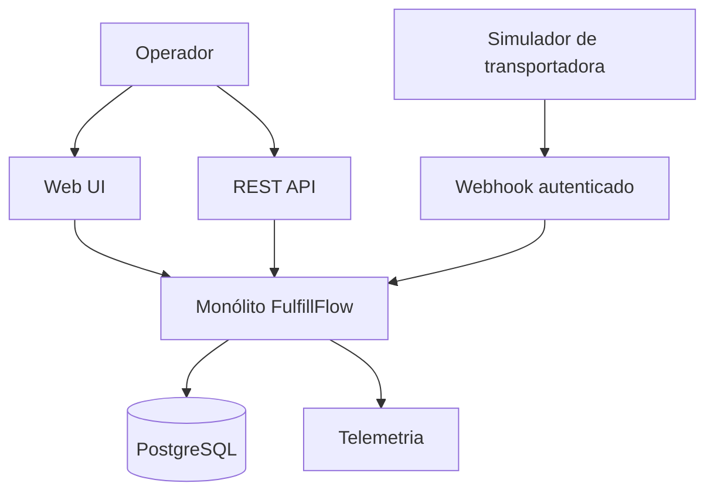
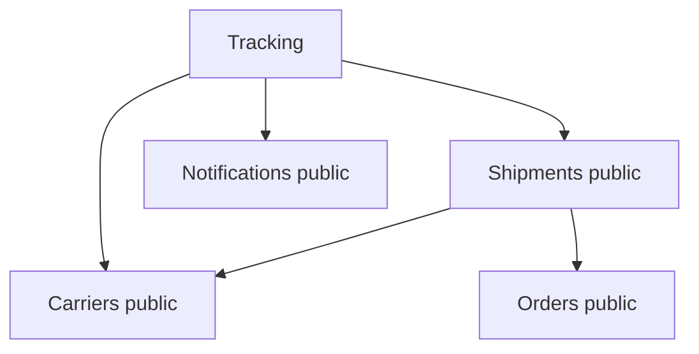
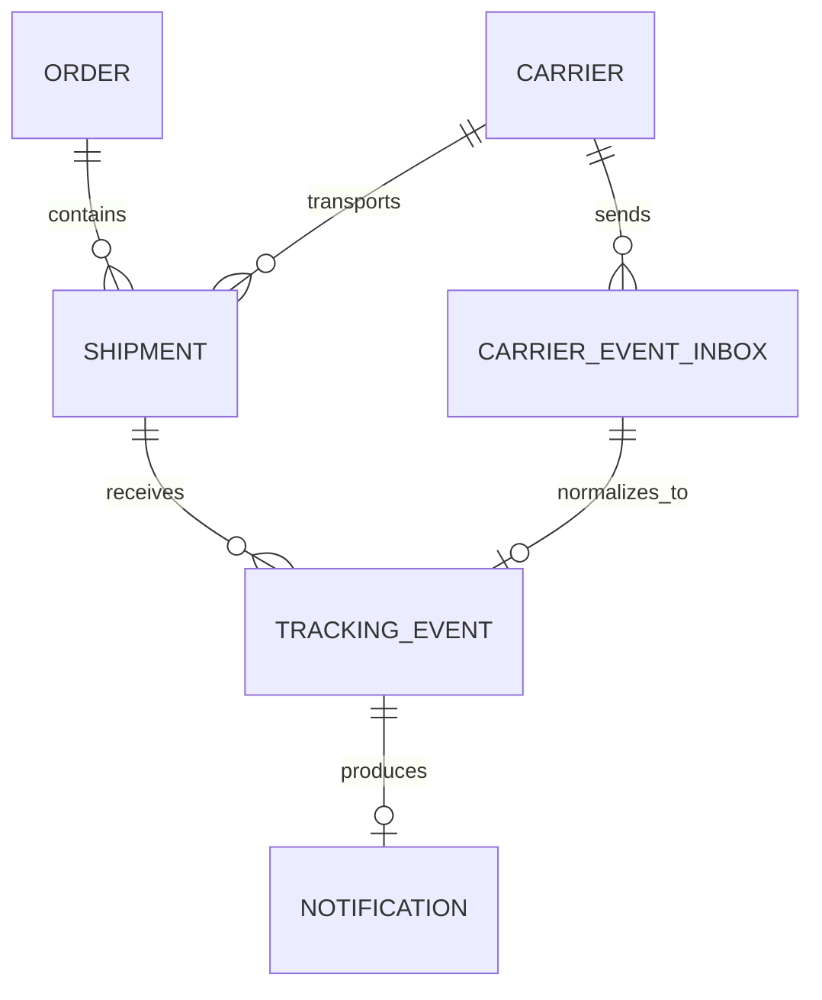
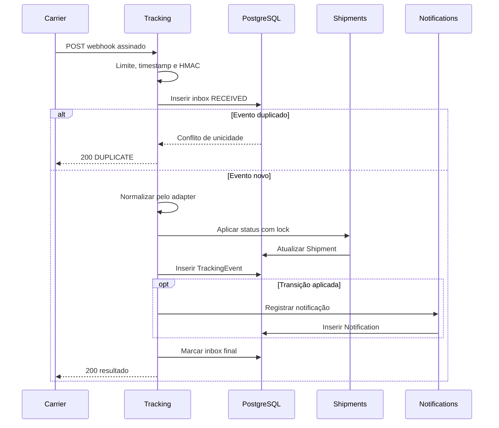

# FulfillFlow — Design Architecture v1.0.0

| Campo | Valor |
|---|---|
| Status | Aprovado para implementação |
| Arquitetura vigente | Monólito modular |
| Escopo | Exclusivamente v1.0.0 |
| Runtime principal | Python 3.13 / FastAPI |
| Persistência | PostgreSQL 18 |
| Última revisão | 2026-08-28 |

## 1. Objetivo

FulfillFlow é uma aplicação web interna para operação e acompanhamento do fluxo entre pedido, remessa, eventos de transportadora e entrega.

A v1.0.0 deve oferecer uma jornada funcional completa e demonstrável:

1. cadastrar um pedido;
2. criar uma ou mais remessas associadas;
3. atribuir transportadora e código de rastreamento;
4. receber webhooks autenticados de duas transportadoras simuladas;
5. preservar o evento recebido em formato original;
6. normalizar o evento para o modelo canônico;
7. validar e aplicar a transição de estado;
8. manter a timeline imutável de tracking;
9. registrar uma notificação simulada;
10. disponibilizar o resultado por API e interface web.

O produto representa um MVP operacional executado em ambiente controlado. Não é um e-commerce, uma plataforma de gestão de armazém nem um sistema pronto para exposição pública.

## 2. Drivers arquiteturais

As decisões da v1.0.0 priorizam:

- consistência transacional no processamento dos eventos;
- fronteiras modulares verificáveis;
- rastreabilidade do payload externo até o estado resultante;
- idempotência e comportamento determinístico;
- contratos HTTP estáveis e versionados;
- execução integral por containers;
- observabilidade suficiente para diagnóstico e medição;
- testes contra PostgreSQL real;
- reprodutibilidade de dados e benchmarks;
- simplicidade operacional sem substituição dos fundamentos por implementações em memória.

## 3. Limites do sistema

### 3.1 Incluído

- pedidos;
- remessas;
- cadastro fixo de duas transportadoras simuladas;
- ingestão autenticada de eventos por webhook;
- adaptação de dois formatos externos distintos;
- normalização para status canônico;
- histórico e estado atual da remessa;
- tratamento de duplicidade, atraso e transição inválida;
- notificações simuladas e persistidas;
- dashboard e telas operacionais;
- API REST `/api/v1`;
- logs estruturados, métricas e tracing;
- seeds de demonstração e benchmark;
- testes funcionais, arquiteturais e de desempenho.

### 3.2 Excluído

- autenticação de usuários, SSO, OAuth ou RBAC;
- multitenancy;
- catálogo de produtos, estoque, picking, packing ou gestão de armazém;
- pagamentos, checkout ou faturamento;
- integração com ERP;
- transportadoras reais;
- envio real de e-mail, SMS, WhatsApp ou push;
- filas, brokers e workers independentes;
- RabbitMQ, Kafka, Redis, Celery ou Taskiq;
- API Gateway;
- Kubernetes, AKS ou qualquer cloud obrigatória;
- React, Vue, Angular ou pipeline Node.js;
- MinIO, Blob Storage ou armazenamento de arquivos;
- IA, LLM ou inferência probabilística;
- reprocessamento automático em background;
- rate limiting distribuído na aplicação.

## 4. Visão arquitetural

A v1.0.0 é um monólito modular: uma aplicação FastAPI, uma imagem implantável e um banco PostgreSQL. Banco e backends opcionais de observabilidade são infraestrutura, não unidades adicionais da aplicação.



### 4.1 Restrições estruturais

- Não há chamadas HTTP entre módulos internos.
- Não há banco por módulo.
- Não há publicação assíncrona de eventos de negócio.
- Uma única transação pode coordenar alterações em múltiplos módulos, desde que cada alteração seja executada pelo serviço público do módulo proprietário.
- Nenhum módulo acessa models ou repositories internos de outro módulo.
- A camada web e os routers não contêm regra de negócio.
- Models ORM não são contratos de API.
- O simulador interage exclusivamente pelos endpoints públicos.

## 5. Stack aprovada

### 5.1 Aplicação

- Python 3.13;
- FastAPI;
- Uvicorn;
- Pydantic v2;
- pydantic-settings;
- SQLAlchemy 2.x com `AsyncSession`;
- psycopg 3 em modo assíncrono;
- Alembic;
- Jinja2;
- HTMX;
- Bootstrap 5.

### 5.2 Qualidade e testes

- pytest;
- pytest-asyncio;
- httpx;
- coverage.py / pytest-cov;
- Ruff para lint e formatação;
- Mypy para análise estática;
- Import Linter para contratos arquiteturais;
- Locust para testes de carga.

### 5.3 Observabilidade

- logging estruturado em JSON;
- OpenTelemetry API, SDK e instrumentações de FastAPI e SQLAlchemy;
- exportação OTLP configurável;
- Prometheus Python Client;
- Jaeger opcional no perfil de observabilidade do Compose.

### 5.4 Empacotamento e execução

- `pyproject.toml`;
- `uv`;
- `uv.lock` versionado;
- Dockerfile multi-stage;
- Docker Compose;
- GitHub Actions.

Versões patch são determinadas pelo `uv.lock`; o DESIGN fixa produtos e linhas principais, não substitui o lockfile.

## 6. Organização do repositório

```text
fulfillflow/
├── AGENTS.md
├── DESIGN.md
├── README.md
├── pyproject.toml
├── uv.lock
├── Dockerfile
├── compose.yaml
├── compose.benchmark.yaml
├── .env.example
├── alembic.ini
├── alembic/
│   └── versions/
├── src/
│   └── fulfillflow/
│       ├── main.py
│       ├── config.py
│       ├── db/
│       │   ├── base.py
│       │   ├── session.py
│       │   └── types.py
│       ├── errors/
│       ├── observability/
│       ├── shared/
│       │   ├── clock.py
│       │   ├── ids.py
│       │   └── pagination.py
│       ├── modules/
│       │   ├── orders/
│       │   ├── shipments/
│       │   ├── carriers/
│       │   ├── tracking/
│       │   └── notifications/
│       └── web/
│           ├── routers/
│           ├── templates/
│           └── static/
├── tests/
│   ├── unit/
│   ├── architecture/
│   ├── integration/
│   └── e2e/
├── benchmarks/
│   ├── README.md
│   ├── locustfile.py
│   ├── datasets/
│   └── results/
└── scripts/
    ├── seed_demo.py
    ├── seed_benchmark.py
    └── simulate_carrier_events.py
```

### 6.1 Estrutura mínima de cada módulo

```text
module/
├── public.py
├── router.py
├── schemas.py
├── models.py
├── repository.py
├── service.py
└── domain.py
```

Arquivos sem conteúdo real não devem ser criados apenas para satisfazer a estrutura. `domain.py` é reservado para enums, regras e objetos sem dependência de infraestrutura; `public.py` expõe apenas os contratos autorizados aos demais módulos.

## 7. Módulos e dependências

### 7.1 Orders

Responsabilidades:

- criar e consultar pedidos;
- validar unicidade da referência externa;
- controlar o estado do pedido;
- expor dados mínimos necessários à criação da remessa;
- expor a operação pública idempotente de conclusão de pedido, sem consultar tabelas de Shipment.

Não depende de módulos de negócio.

### 7.2 Carriers

Responsabilidades:

- consultar transportadoras cadastradas;
- localizar o adapter pelo código da transportadora;
- validar o schema específico do payload externo;
- converter o payload externo em `CanonicalCarrierEvent`;
- mapear status externo para status canônico.

Não inicia processamento de tracking e não grava tabelas de tracking.
`adapter_key` é resolvido por allowlist estática no código; nenhum nome vindo do banco é usado em import dinâmico.

### 7.3 Shipments

Responsabilidades:

- criar e consultar remessas;
- garantir unicidade de `(carrier_id, tracking_code)`;
- controlar a máquina de estados da remessa;
- aplicar status de tracking sob bloqueio transacional;
- manter datas derivadas como `shipped_at` e `delivered_at`;
- avaliar, a partir de suas próprias remessas, se um Order pode ser concluído e solicitar a transição pela interface pública de Orders.

Pode depender apenas das interfaces públicas de Orders e Carriers.

### 7.4 Notifications

Responsabilidades:

- produzir a mensagem correspondente a uma transição aplicada;
- registrar a simulação de notificação;
- expor consultas operacionais.

Não envia mensagens para provedores externos.
Falha esperada de renderização/simulação produz registro `FAILED` e não desfaz uma transição válida de Shipment; falha de persistência continua sendo falha da Transação B.

### 7.5 Tracking

Responsabilidades:

- expor o endpoint de webhook;
- autenticar a requisição antes da persistência;
- registrar o evento bruto autenticado;
- detectar duplicidade;
- solicitar normalização ao módulo Carriers;
- localizar a remessa pelo contrato público de Shipments;
- persistir o evento canônico;
- coordenar a aplicação da transição por Shipments;
- solicitar o registro da notificação por Notifications;
- finalizar o status de processamento do inbox;
- expor a timeline.

Pode depender das interfaces públicas de Carriers, Shipments e Notifications.



### 7.6 Shared

Contém somente primitivas transversais estáveis: `Clock`, geração de UUID, paginação e tipos técnicos sem semântica de negócio. Todos os módulos podem depender de Shared; Shared não depende de módulo, FastAPI, ORM ou banco.

Tempo de domínio é obtido por uma interface `Clock` injetável. Chamadas diretas a `datetime.now()` ficam restritas à implementação concreta do clock, evitando relógio real em testes.

### 7.7 Contratos arquiteturais

O Import Linter deve verificar:

- ausência de ciclos entre módulos irmãos;
- proibição de importação de `models.py` e `repository.py` fora do módulo proprietário;
- acesso externo ao módulo apenas por `public.py`, `schemas.py` quando explicitamente público, ou routers registrados em `main.py`;
- ausência de dependência dos módulos de domínio sobre `web/`;
- ausência de dependência de `domain.py` sobre FastAPI, SQLAlchemy ou infraestrutura.

Testes de integração validam o comportamento; contratos arquiteturais validam imports. Um não substitui o outro.

## 8. Modelo de domínio

### 8.1 Entidades

#### Order

| Campo | Tipo | Regras |
|---|---|---|
| `id` | UUID | PK, gerado pela aplicação |
| `external_reference` | varchar(64) | obrigatório, único |
| `recipient_name` | varchar(160) | obrigatório |
| `recipient_email` | varchar(254) | obrigatório, sintético |
| `recipient_postal_code` | varchar(16) | obrigatório |
| `recipient_city` | varchar(120) | obrigatório |
| `recipient_state` | char(2) | obrigatório, maiúsculo |
| `status` | enum textual | `CREATED`, `CONFIRMED`, `FULFILLED`, `CANCELLED` |
| `created_at` | timestamptz | UTC, obrigatório |
| `updated_at` | timestamptz | UTC, obrigatório |

#### Carrier

| Campo | Tipo | Regras |
|---|---|---|
| `id` | UUID | PK |
| `code` | varchar(32) | obrigatório, único, imutável |
| `name` | varchar(120) | obrigatório |
| `adapter_key` | varchar(64) | obrigatório, único |
| `active` | boolean | default `true` |
| `created_at` | timestamptz | UTC |
| `updated_at` | timestamptz | UTC |

O secret HMAC não é persistido. O `code` resolve o adapter e a configuração segura correspondente.

#### Shipment

| Campo | Tipo | Regras |
|---|---|---|
| `id` | UUID | PK |
| `order_id` | UUID | FK `orders.id`, obrigatório |
| `carrier_id` | UUID | FK `carriers.id`, obrigatório |
| `tracking_code` | varchar(80) | obrigatório |
| `status` | enum textual | status canônico atual |
| `status_occurred_at` | timestamptz | instante do evento que determinou o status atual |
| `status_event_received_at` | timestamptz | recepção do evento determinante; `null` enquanto `PENDING` inicial |
| `status_external_event_id` | varchar(128) | desempate determinístico; `null` enquanto `PENDING` inicial |
| `estimated_delivery_date` | date | opcional |
| `shipped_at` | timestamptz | preenchido na primeira saída logística |
| `delivered_at` | timestamptz | preenchido em `DELIVERED` |
| `created_at` | timestamptz | UTC |
| `updated_at` | timestamptz | UTC |

Constraint única: `(carrier_id, tracking_code)`.

#### CarrierEventInbox

| Campo | Tipo | Regras |
|---|---|---|
| `id` | UUID | PK |
| `carrier_id` | UUID | FK, obrigatório |
| `external_event_id` | varchar(128) | obrigatório |
| `payload_sha256` | char(64) | hash dos bytes originais |
| `raw_body` | bytea | bytes autenticados exatamente como recebidos, limite 64 KiB |
| `parsed_payload` | jsonb | JSON parseado quando válido; `null` para JSON inválido |
| `received_at` | timestamptz | horário do servidor |
| `status` | enum textual | `RECEIVED`, `PROCESSED`, `REJECTED` |
| `error_code` | varchar(64) | opcional |
| `error_detail` | text | opcional, sem secrets |
| `processed_at` | timestamptz | opcional |
| `request_id` | UUID | correlação |

Constraint única: `(carrier_id, external_event_id)`.

Uma tentativa repetida com o mesmo hash não cria nova linha. Se o inbox original estiver `RECEIVED`, a requisição pode retomar o processamento; se estiver finalizado, devolve o resultado original. Reuso de `(carrier_id, external_event_id)` com outro hash é conflito e nunca substitui o evento original.

#### TrackingEvent

| Campo | Tipo | Regras |
|---|---|---|
| `id` | UUID | PK |
| `inbox_event_id` | UUID | FK única para inbox |
| `shipment_id` | UUID | FK, obrigatório |
| `carrier_id` | UUID | FK, obrigatório |
| `external_status` | varchar(120) | valor recebido |
| `canonical_status` | enum textual | status normalizado |
| `description` | varchar(500) | opcional |
| `location` | varchar(240) | opcional |
| `occurred_at` | timestamptz | horário do evento na origem |
| `received_at` | timestamptz | horário local de ingestão |
| `application_result` | enum textual | resultado da aplicação |
| `previous_shipment_status` | enum textual | opcional |
| `resulting_shipment_status` | enum textual | obrigatório |
| `created_at` | timestamptz | UTC |

`application_result`:

- `APPLIED`;
- `NO_STATE_CHANGE`;
- `IGNORED_STALE`;
- `IGNORED_INVALID_TRANSITION`.

O registro é append-only. Correções administrativas não fazem parte da v1.0.0.

#### Notification

| Campo | Tipo | Regras |
|---|---|---|
| `id` | UUID | PK |
| `shipment_id` | UUID | FK, obrigatório |
| `tracking_event_id` | UUID | FK, único |
| `channel` | enum textual | `EMAIL` na v1.0.0 |
| `recipient` | varchar(254) | endereço sintético do pedido |
| `template_key` | varchar(80) | template determinístico |
| `message` | text | conteúdo renderizado |
| `status` | enum textual | `SIMULATED` ou `FAILED` |
| `error_detail` | text | opcional |
| `created_at` | timestamptz | UTC |
| `simulated_at` | timestamptz | opcional |

### 8.2 Relacionamentos



### 8.3 Índices obrigatórios

- `orders(external_reference)` unique;
- `orders(status, created_at desc)`;
- `shipments(carrier_id, tracking_code)` unique;
- `shipments(order_id)`;
- `shipments(status, updated_at desc)`;
- `carrier_event_inbox(carrier_id, external_event_id)` unique;
- `carrier_event_inbox(status, received_at)`;
- `tracking_events(shipment_id, occurred_at desc, created_at desc)`;
- `tracking_events(inbox_event_id)` unique;
- `notifications(status, created_at desc)`;
- `notifications(tracking_event_id)` unique.

### 8.4 Representação física e integridade

- UUIDs usam o tipo nativo `uuid` e são gerados como UUIDv4 pela aplicação;
- timestamps usam `timestamptz`, são persistidos em UTC e convertidos apenas na apresentação;
- enums de domínio são `varchar` com `CHECK` nomeado, não PostgreSQL native enum;
- FKs de registros de negócio usam `ON DELETE RESTRICT`; exclusão em cascata não é permitida;
- `updated_at` é mantido pela aplicação na mesma transação da alteração; não há triggers de auditoria;
- `tracking_code` é armazenado e pesquisado após `strip` e conversão para maiúsculas;
- `carrier.code` é slug ASCII minúsculo e imutável;
- `external_event_id` é case-sensitive, usa somente ASCII visível sem whitespace lateral e não é reescrito depois da validação do header;
- campos externos extras são tolerados pelo adapter, mas não entram no contrato canônico;
- valores vazios após normalização são inválidos;
- todos os comprimentos declarados são validados na borda e protegidos novamente no schema;
- `raw_body` é a fonte forense; `parsed_payload` é uma projeção de consulta e não substitui os bytes originais.

## 9. Máquinas de estados

### 9.1 Order

| Estado atual | Próximos estados permitidos |
|---|---|
| `CREATED` | `CONFIRMED`, `CANCELLED` |
| `CONFIRMED` | `FULFILLED` |
| `FULFILLED` | nenhum |
| `CANCELLED` | nenhum |

Regras:

- remessas só podem ser criadas para pedido `CONFIRMED`;
- pedido só pode ser cancelado enquanto estiver `CREATED` e, portanto, antes da criação de remessas;
- pedido torna-se `FULFILLED` quando existe ao menos uma remessa não cancelada e todas as remessas não canceladas estiverem `DELIVERED`;
- pedido sem remessa não pode ser `FULFILLED`.
- o predicado de conclusão é reavaliado quando uma Shipment resulta em `DELIVERED` ou
  `CANCELLED`, tanto por evento externo quanto por cancelamento manual, sempre sob locks na ordem
  Shipment → Order.

`confirm` em pedido já `CONFIRMED` e `cancel` em pedido já `CANCELLED` são sucessos idempotentes. Ação sobre qualquer outro estado não permitido retorna 409.

### 9.2 Shipment

| Estado atual | Próximos estados permitidos |
|---|---|
| `PENDING` | `POSTED`, `IN_TRANSIT`, `OUT_FOR_DELIVERY`, `DELIVERED`, `EXCEPTION`, `CANCELLED` |
| `POSTED` | `IN_TRANSIT`, `OUT_FOR_DELIVERY`, `DELIVERED`, `EXCEPTION`, `RETURNED` |
| `IN_TRANSIT` | `OUT_FOR_DELIVERY`, `DELIVERED`, `EXCEPTION`, `RETURNED` |
| `OUT_FOR_DELIVERY` | `IN_TRANSIT`, `DELIVERED`, `EXCEPTION`, `RETURNED` |
| `EXCEPTION` | `IN_TRANSIT`, `OUT_FOR_DELIVERY`, `DELIVERED`, `RETURNED` |
| `DELIVERED` | nenhum |
| `RETURNED` | nenhum |
| `CANCELLED` | nenhum |

Regras:

- criação inicia em `PENDING`;
- `shipped_at` recebe o `occurred_at` do primeiro evento aplicado em `POSTED`, `IN_TRANSIT`, `OUT_FOR_DELIVERY`, `DELIVERED` ou `RETURNED`; `EXCEPTION` isolado não comprova postagem;
- `delivered_at` recebe o `occurred_at` do evento aplicado `DELIVERED`;
- estado terminal não regride;
- a ordem total de eventos usa a chave `(occurred_at, received_at, external_event_id)` em ordem lexicográfica;
- enquanto a Shipment estiver no `PENDING` inicial, sem evento externo determinante, o primeiro evento válido não é considerado atrasado apenas por anteceder `created_at`;
- depois do primeiro evento externo, chave anterior à chave determinante atual é registrada como `IGNORED_STALE`;
- evento com o mesmo estado e chave posterior é registrado como `NO_STATE_CHANGE` e avança os três campos de ordenação, sem alterar o status;
- transição não listada é registrada como `IGNORED_INVALID_TRANSITION`;
- saltos para estados posteriores são aceitos porque transportadoras podem omitir eventos intermediários;
- eventos `IGNORED_*` não criam notificação e não alteram Order ou Shipment;
- `NO_STATE_CHANGE` não cria notificação nem reavalia o Order.

`cancel` em Shipment já `CANCELLED` é sucesso idempotente. Cancelamento manual em qualquer estado diferente de `PENDING` ou `CANCELLED` retorna 409.
Cancelamento manual não fabrica evento de transportadora: altera a Shipment, registra log de domínio e não cria `CarrierEventInbox`, `TrackingEvent` ou Notification.

## 10. Contrato canônico de evento

Adapters retornam exclusivamente:

```python
class CanonicalCarrierEvent(BaseModel):
    external_event_id: str
    tracking_code: str
    canonical_status: ShipmentStatus
    external_status: str
    occurred_at: datetime
    description: str | None
    location: str | None
```

Invariantes:

- `occurred_at` deve possuir timezone;
- strings são normalizadas sem perda do payload bruto;
- adapter não consulta banco;
- adapter não altera estado;
- status externo desconhecido rejeita o inbox com `UNKNOWN_EXTERNAL_STATUS`;
- campos extras do fornecedor permanecem apenas em `parsed_payload` e `raw_body`.

## 11. Transportadoras simuladas

### 11.1 Carrier Alpha

Código: `carrier-alpha`.

Payload:

```json
{
  "eventId": "alpha-evt-000001",
  "trackingCode": "ALPHA000001",
  "status": "MOVING",
  "eventDate": "2026-08-28T15:20:00Z",
  "city": "São Bernardo do Campo",
  "description": "Transferência entre unidades"
}
```

Mapeamento:

| Externo | Canônico |
|---|---|
| `CREATED` | `POSTED` |
| `MOVING` | `IN_TRANSIT` |
| `OUT_FOR_DELIVERY` | `OUT_FOR_DELIVERY` |
| `DELIVERED` | `DELIVERED` |
| `PROBLEM` | `EXCEPTION` |
| `RETURNED` | `RETURNED` |

### 11.2 Carrier Beta

Código: `carrier-beta`.

Payload:

```json
{
  "id": "beta-evt-000001",
  "tracking_number": "BETA000001",
  "event": {
    "type": "hub_scan",
    "occurred_at": "2026-08-28T15:20:00-03:00",
    "details": "Recebido no centro de distribuição"
  },
  "location": {
    "city": "São Paulo",
    "state": "SP"
  }
}
```

Mapeamento:

| Externo | Canônico |
|---|---|
| `label_created` | `POSTED` |
| `hub_scan` | `IN_TRANSIT` |
| `courier_route` | `OUT_FOR_DELIVERY` |
| `completed` | `DELIVERED` |
| `delivery_issue` | `EXCEPTION` |
| `returned_origin` | `RETURNED` |

## 12. Autenticação dos webhooks

### 12.1 Headers

```text
Content-Type: application/json
X-FulfillFlow-Event-Id: <external_event_id>
X-FulfillFlow-Timestamp: <unix_seconds>
X-FulfillFlow-Signature: sha256=<hex_digest>
```

### 12.2 Assinatura

```text
signed_payload = timestamp + "." + event_id + "." + raw_body
signature = HMAC-SHA256(carrier_secret, signed_payload)
```

Em bytes:

```python
signed_payload = (
    timestamp.encode("ascii")
    + b"."
    + event_id.encode("utf-8")
    + b"."
    + raw_body
)
```

Regras:

- secret distinto por transportadora;
- secrets fornecidos apenas por variáveis de ambiente;
- comparação por `hmac.compare_digest`;
- timestamp representado por inteiro decimal de segundos Unix, sem espaços;
- `event_id` não vazio, com no máximo 128 caracteres;
- cada header autenticado ocorre exatamente uma vez; ausência ou duplicidade é inválida;
- assinatura em 64 dígitos hexadecimais após o prefixo `sha256=`;
- tolerância de timestamp padrão de 300 segundos;
- corpo máximo padrão de 65.536 bytes;
- HMAC calculado sobre os bytes originais, antes do parse JSON;
- `event_id` do header deve coincidir com o identificador extraído pelo adapter;
- assinatura, secret e corpo completo não são gravados em logs;
- requisição não autenticada não é persistida;
- ausência de carrier, headers, assinatura válida ou timestamp válido retorna erro antes do acesso de negócio.

### 12.3 Simulador

O simulador externo fica em `scripts/simulate_carrier_events.py` e recebe base URL, carrier,
tracking code e cenário por argumento ou ambiente. O secret não é aceito por argumento nem por
variável genérica: `carrier-alpha` usa exclusivamente `CARRIER_ALPHA_WEBHOOK_SECRET` e
`carrier-beta` usa exclusivamente `CARRIER_BETA_WEBHOOK_SECRET`.

Os nomes e as semânticas normativas dos cenários são:

| Cenário | Semântica esperada |
|---|---|
| `valid` | envia, no schema externo do carrier escolhido, a sequência válida que normaliza para `POSTED -> IN_TRANSIT -> OUT_FOR_DELIVERY -> DELIVERED`; cada resposta retorna 200 e `APPLIED`, terminando em `DELIVERED` |
| `duplicate` | envia um evento válido e repete exatamente `raw_body`, event ID, timestamp do header e assinatura; a repetição retorna 200 e `DUPLICATE` |
| `out-of-order` | envia um evento válido e depois outro evento válido com chave de ordenação anterior; o segundo retorna 200 e `IGNORED_STALE` |
| `unknown-status` | envia payload autenticado no schema do carrier com status externo desconhecido; retorna 422 e `UNKNOWN_EXTERNAL_STATUS` |
| `invalid-signature` | envia payload sintaticamente válido com assinatura inválida; retorna 401 e `INVALID_WEBHOOK_SIGNATURE`, sem persistência |

Quando seed, IDs e relógio forem fornecidos, a sequência é determinística; na execução manual, os
defaults geram IDs únicos e timestamp dentro da janela aceita. O payload é serializado uma única vez
e exatamente os mesmos bytes assinados são enviados.

O processo termina com exit code zero somente quando todas as respostas observadas coincidem com a
semântica do cenário. Assim, 422 em `unknown-status` e 401 em `invalid-signature` são resultados
esperados e bem-sucedidos do simulador apenas quando acompanhados pelos respectivos códigos de
problema; resposta inesperada, timeout ou erro de rede resulta em exit code diferente de zero.

O simulador mostra apenas status HTTP e resultado operacional sanitizado, nunca secret ou
assinatura. Ele não importa código da aplicação, não acessa PostgreSQL e interage exclusivamente por
HTTP com `POST /api/v1/carriers/{carrier_code}/events`.

## 13. Processamento de webhook



### 13.1 Fronteiras transacionais

#### Transação A — recepção

1. validar autenticação fora do banco;
2. inserir `CarrierEventInbox(RECEIVED)` com `raw_body`, hash e metadados de recepção;
3. realizar commit;
4. em conflito único, carregar o evento original;
5. se o hash divergir, responder conflito sem processar o novo body;
6. se o hash coincidir, seguir para a Transação B usando o inbox original.

O commit independente garante preservação do evento autenticado mesmo se o processamento de negócio falhar.

#### Transação B — processamento de negócio

1. carregar e bloquear o inbox com `SELECT ... FOR UPDATE`;
2. se estiver `PROCESSED`, devolver `DUPLICATE` com o resultado original;
3. se estiver `REJECTED`, devolver novamente a rejeição registrada;
4. se estiver `RECEIVED`, decodificar e validar JSON, persistindo `parsed_payload` quando válido;
5. normalizar pelo adapter;
6. localizar Shipment por carrier e tracking code;
7. bloquear Shipment com `SELECT ... FOR UPDATE`;
8. determinar resultado usando a chave total do evento;
9. inserir TrackingEvent;
10. se `APPLIED`, atualizar estado e campos de ordenação da Shipment;
11. se `NO_STATE_CHANGE`, atualizar apenas os campos de ordenação da Shipment;
12. se `APPLIED`, registrar Notification pelo serviço proprietário;
13. se o estado resultante for `DELIVERED` ou `CANCELLED`, bloquear o Order pela interface pública de Orders;
14. somente nesses casos, Shipments avalia todas as remessas não canceladas do Order e, quando aplicável, solicita sua conclusão;
15. marcar inbox `PROCESSED`;
16. commit atômico.

#### Falha de processamento

Após erro permanente de schema ou negócio e rollback da Transação B, uma transação curta deve marcar o inbox como `REJECTED`, com `parsed_payload` quando disponível, `error_code`, detalhe sanitizado e `processed_at`.

JSON autenticado, porém sintaticamente inválido, permanece preservado em `raw_body` e é rejeitado com `INVALID_JSON`. Erros de autenticação não geram inbox.

Falha transitória de infraestrutura não converte o inbox em `REJECTED`: ele permanece `RECEIVED` e a resposta é 503. Nova entrega idêntica retoma a Transação B. Essa retomada síncrona é obrigatória porque não existe worker de reprocessamento na v1.0.0.

Falha inesperada da aplicação depois da Transação A retorna 500 e também preserva `RECEIVED`, para não classificar um defeito interno como rejeição definitiva do fornecedor.

### 13.2 Concorrência

- `AsyncSession` por requisição;
- isolamento PostgreSQL `READ COMMITTED`;
- lock pessimista da Shipment durante aplicação do status;
- unique constraint como autoridade final de idempotência;
- nenhum check-then-insert sem tratamento do conflito no banco;
- concorrência simultânea do mesmo `event_id` deve gerar um único inbox;
- concorrência de eventos distintos para a mesma Shipment deve serializar a transição;
- concorrência das últimas entregas de Shipments diferentes do mesmo Order deve serializar pelo lock do Order e produzir exatamente uma transição para `FULFILLED`;
- locks são adquiridos na ordem inbox, Shipment e Order; código algum pode inverter essa ordem;
- retries de erro transitório devem ser limitados e ocorrer apenas na camada de persistência da mesma requisição; não existe fila de retry.

## 14. API REST

### 14.1 Convenções

- prefixo `/api/v1`;
- JSON UTF-8;
- nomes de campos em `snake_case`;
- timestamps ISO 8601 com timezone;
- paginação por `page` e `page_size`;
- `page_size` default 25, máximo 100;
- ordenação estável com desempate por UUID;
- schemas distintos para create, update, read e list;
- resposta de erro em `application/problem+json`, compatível com RFC 9457;
- `X-Request-ID` devolvido em todas as respostas;
- rotas externas não expõem models ORM.

### 14.2 Erro padronizado

```json
{
  "type": "https://fulfillflow.local/problems/invalid-transition",
  "title": "Invalid shipment transition",
  "status": 409,
  "code": "INVALID_SHIPMENT_TRANSITION",
  "detail": "Transition DELIVERED -> IN_TRANSIT is not allowed.",
  "request_id": "9e443f7d-440f-4918-aa0f-fc9b753f2c70",
  "errors": []
}
```

Códigos estáveis:

- `VALIDATION_ERROR`;
- `RESOURCE_NOT_FOUND`;
- `RESOURCE_CONFLICT`;
- `INVALID_ORDER_TRANSITION`;
- `INVALID_SHIPMENT_TRANSITION`;
- `PAYLOAD_TOO_LARGE`;
- `INVALID_WEBHOOK_SIGNATURE`;
- `STALE_WEBHOOK_TIMESTAMP`;
- `INVALID_JSON`;
- `EVENT_ID_MISMATCH`;
- `EVENT_ID_PAYLOAD_CONFLICT`;
- `UNKNOWN_EXTERNAL_STATUS`;
- `SHIPMENT_NOT_FOUND_FOR_TRACKING`;
- `DATABASE_UNAVAILABLE`;
- `UNSUPPORTED_MEDIA_TYPE`;
- `INTERNAL_ERROR`.

Handlers globais convertem inclusive validações do FastAPI/Pydantic, 404, 405 e falhas conhecidas para o mesmo formato problem detail; não deve escapar o schema de erro padrão do framework nas rotas públicas.

### 14.3 Semântica HTTP do webhook

| Condição | HTTP | Persistência | Resultado |
|---|---:|---|---|
| processado e aplicado | 200 | inbox, tracking, alteração e notificação | `APPLIED` |
| mesmo estado | 200 | inbox e tracking | `NO_STATE_CHANGE` |
| evento atrasado | 200 | inbox e tracking | `IGNORED_STALE` |
| transição inválida | 200 | inbox e tracking | `IGNORED_INVALID_TRANSITION` |
| `event_id` e hash duplicados, inbox processado | 200 | nenhuma linha adicional | `DUPLICATE` com resultado original |
| `event_id` e hash duplicados, inbox recebido | resultado da retomada | reutiliza o inbox original | processamento normal |
| `event_id` já usado com outro hash | 409 | nenhuma linha adicional | `EVENT_ID_PAYLOAD_CONFLICT` |
| carrier desconhecido ou inativo | 404 | nenhuma | problem detail |
| assinatura ausente ou inválida | 401 | nenhuma | problem detail |
| timestamp expirado ou futuro fora da janela | 401 | nenhuma | problem detail |
| body acima do limite | 413 | nenhuma | problem detail |
| media type diferente de `application/json` | 415 | nenhuma | problem detail |
| JSON inválido após autenticação | 422 | inbox `REJECTED` com raw bytes | problem detail |
| payload inválido, status desconhecido ou ID divergente | 422 | inbox `REJECTED` | problem detail |
| tracking code não localizado | 422 | inbox `REJECTED` | problem detail |
| indisponibilidade de banco antes da recepção | 503 | nenhuma confirmação | problem detail |

Respostas 200 confirmam que o evento não precisa ser reenviado, mesmo quando não alterou o estado. Respostas 401, 413, 415 e 422 não devem ser repetidas sem correção do remetente; se o body mudar, a correção usa novo `external_event_id`. Em 500 ou 503, o remetente pode repetir os mesmos bytes com o mesmo ID.

### 14.4 Rotas

#### Orders

| Método | Rota | Resultado |
|---|---|---|
| POST | `/api/v1/orders` | 201, cria Order em `CREATED` |
| GET | `/api/v1/orders` | 200, lista paginada e filtrável |
| GET | `/api/v1/orders/{order_id}` | 200, detalhe com resumo das remessas |
| POST | `/api/v1/orders/{order_id}/confirm` | 200, `CREATED -> CONFIRMED` |
| POST | `/api/v1/orders/{order_id}/cancel` | 200 ou 409 |

Request de criação:

```json
{
  "external_reference": "ORDER-2026-000001",
  "recipient": {
    "name": "Cliente Demonstração 001",
    "email": "cliente001@example.test",
    "postal_code": "09700-000",
    "city": "São Bernardo do Campo",
    "state": "SP"
  }
}
```

#### Shipments

| Método | Rota | Resultado |
|---|---|---|
| POST | `/api/v1/shipments` | 201, cria Shipment em `PENDING` |
| GET | `/api/v1/shipments` | 200, lista paginada e filtrável |
| GET | `/api/v1/shipments/{shipment_id}` | 200, detalhe operacional |
| POST | `/api/v1/shipments/{shipment_id}/cancel` | 200 ou 409 |
| GET | `/api/v1/shipments/{shipment_id}/tracking` | 200, timeline ordenada |

Request de criação:

```json
{
  "order_id": "0dfc9d7d-d338-417f-9dcc-b0e6cb11e47d",
  "carrier_code": "carrier-alpha",
  "tracking_code": "ALPHA000001",
  "estimated_delivery_date": "2026-09-03"
}
```

Filtros mínimos de listagem:

- `status`;
- `carrier_code`;
- `order_external_reference`;
- `tracking_code`;
- `created_from`;
- `created_to`.

Toda listagem JSON retorna:

```json
{
  "items": [],
  "page": 1,
  "page_size": 25,
  "total": 0
}
```

#### Carrier events

| Método | Rota | Resultado |
|---|---|---|
| POST | `/api/v1/carriers/{carrier_code}/events` | 200, resultado do processamento |
| GET | `/api/v1/carrier-events` | 200, consulta operacional do inbox |
| GET | `/api/v1/carrier-events/{inbox_event_id}` | 200, detalhe sanitizado pelo UUID interno do inbox |

Resposta aplicada:

```json
{
  "external_event_id": "alpha-evt-000001",
  "inbox_event_id": "74cbbb9f-3f15-43f0-8917-76cd843cf0f7",
  "tracking_event_id": "b6c22f99-8f17-44ca-92a4-c4c9db089c70",
  "result": "APPLIED",
  "shipment_id": "c622f547-27f2-465b-9036-cd181c4d3f58",
  "previous_status": "POSTED",
  "current_status": "IN_TRANSIT",
  "request_id": "9e443f7d-440f-4918-aa0f-fc9b753f2c70"
}
```

Resposta duplicada de inbox já processado retorna 200, `result: DUPLICATE`, o `original_result` e os IDs do processamento original. Repetição de inbox rejeitado devolve o mesmo problem detail registrado. Reuso do ID com conteúdo diferente retorna 409.

#### Notifications

| Método | Rota | Resultado |
|---|---|---|
| GET | `/api/v1/notifications` | 200, lista paginada e filtrável |
| GET | `/api/v1/notifications/{notification_id}` | 200, detalhe |

Carrier events aceitam filtros por `carrier_code`, `status`, `external_event_id`, `received_from` e `received_to`. Notifications aceitam `status`, `shipment_id`, `created_from` e `created_to`.

## 15. Interface web

### 15.1 Estratégia

- HTML renderizado pelo servidor;
- Jinja2 com autoescape;
- HTMX apenas para requisições relativas à própria aplicação;
- Bootstrap e HTMX mantidos em `web/static`;
- nenhuma dependência de CDN em runtime;
- formulários e tabelas usam os mesmos serviços de aplicação da API, sem chamadas HTTP internas;
- respostas HTMX retornam fragments; navegação convencional retorna páginas completas;
- responses que variam por `HX-Request` enviam `Vary: HX-Request`.

### 15.2 Telas obrigatórias

- dashboard com contagem por status e eventos recentes;
- lista de Orders;
- criação e detalhe de Order;
- confirmação e cancelamento de Order;
- lista de Shipments com filtros;
- criação e detalhe de Shipment;
- timeline de Tracking;
- lista e detalhe de CarrierEventInbox;
- lista e detalhe somente leitura de Notifications;
- painel instrucional do simulador externo para os dois carriers.

O dashboard apresenta contagens de Orders, Shipments, CarrierEventInbox e Notifications agrupadas
por seus respectivos status, além dos registros mais recentes do inbox em projeção sanitizada. O
limite de apresentação dos registros recentes é detalhe local de implementação.

O painel `/simulator` documenta como executar `scripts/simulate_carrier_events.py`; ele não dispara
eventos, não recebe nem renderiza secrets e não cria uma chamada HTTP da aplicação para ela mesma.

### 15.3 Rotas HTML

| Método | Rota | Finalidade |
|---|---|---|
| GET | `/` | dashboard operacional |
| GET | `/orders` | lista de Orders |
| GET | `/orders/new` | formulário de criação de Order |
| POST | `/orders` | criação de Order |
| GET | `/orders/{order_id}` | detalhe de Order e composição com suas Shipments |
| POST | `/orders/{order_id}/confirm` | confirmação de Order |
| POST | `/orders/{order_id}/cancel` | cancelamento de Order |
| GET | `/shipments` | lista filtrável de Shipments |
| GET | `/shipments/new` | formulário de criação de Shipment |
| POST | `/shipments` | criação de Shipment |
| GET | `/shipments/{shipment_id}` | detalhe operacional de Shipment |
| POST | `/shipments/{shipment_id}/cancel` | cancelamento de Shipment |
| GET | `/shipments/{shipment_id}/tracking` | timeline de Tracking da Shipment |
| GET | `/carrier-events` | lista operacional do inbox |
| GET | `/carrier-events/{inbox_event_id}` | detalhe sanitizado do inbox |
| GET | `/notifications` | lista de Notifications |
| GET | `/notifications/{notification_id}` | detalhe somente leitura de Notification |
| GET | `/simulator` | instruções do simulador externo |
| GET | `/static/{path}` | assets locais versionados |

Requisições HTMX usam essas mesmas rotas e podem receber fragments; não existem endpoints HTML
paralelos apenas para fragments. `/shipments/new` aceita `order_id` como query parameter para
pré-preencher o Order associado.

### 15.4 Restrições

- nenhuma regra de domínio em templates;
- ações mutáveis nunca usam GET;
- formulários mutáveis incluem token CSRF vinculado à sessão assinada;
- mensagens de erro apresentam `request_id`;
- dados de usuário são escapados;
- UI não expõe raw secrets, assinatura ou configuração interna;
- `parsed_payload` pode ser exibido formatado no detalhe operacional do ambiente controlado;
- `raw_body` inválido deve ser apresentado como texto escapado e truncado para a UI, nunca interpretado como HTML;
- headers sensíveis nunca são exibidos.

## 16. Configuração

Configuração central por `BaseSettings`, validada no startup.

| Variável | Obrigatória | Default local | Finalidade |
|---|---:|---|---|
| `APP_ENV` | não | `local` | `local`, `test`, `benchmark` |
| `APP_NAME` | não | `FulfillFlow` | identificação |
| `APP_HOST` | não | `0.0.0.0` | bind interno |
| `APP_PORT` | não | `8000` | porta interna |
| `APP_TIMEZONE` | não | `America/Sao_Paulo` | apresentação |
| `DATABASE_URL` | sim | — | DSN PostgreSQL assíncrona |
| `DB_POOL_SIZE` | não | `10` | conexões persistentes por processo |
| `DB_MAX_OVERFLOW` | não | `0` | conexões extras por processo |
| `DB_POOL_TIMEOUT_SECONDS` | não | `5` | espera por conexão |
| `DB_STATEMENT_TIMEOUT_MS` | não | `5000` | limite por statement |
| `LOG_LEVEL` | não | `INFO` | nível de log |
| `LOG_FORMAT` | não | `json` | `json` ou `console` |
| `SESSION_SECRET` | sim | — | assinatura da sessão e token CSRF da UI |
| `CARRIER_ALPHA_WEBHOOK_SECRET` | sim | — | HMAC Alpha |
| `CARRIER_BETA_WEBHOOK_SECRET` | sim | — | HMAC Beta |
| `WEBHOOK_SIGNATURE_TOLERANCE_SECONDS` | não | `300` | janela anti-replay |
| `MAX_WEBHOOK_BODY_BYTES` | não | `65536` | limite do body |
| `METRICS_ENABLED` | não | `true` | `/metrics` |
| `OTEL_ENABLED` | não | `false` | tracing |
| `OTEL_SERVICE_NAME` | não | `fulfillflow` | resource name |
| `OTEL_EXPORTER_OTLP_ENDPOINT` | condicional | — | destino OTLP |
| `OTEL_TRACES_SAMPLER` | não | `parentbased_traceidratio` | política de sampling |
| `OTEL_TRACES_SAMPLER_ARG` | não | `1.0` local | amostragem |
| `SEED_RANDOM_SEED` | não | `20260828` | dados determinísticos |

Regras:

- a aplicação falha no startup se configuração obrigatória estiver ausente;
- `DATABASE_URL` usa o dialect `postgresql+psycopg` e nunca aponta para fallback SQLite;
- secrets vazios ou triviais são rejeitados fora de `test`; os secrets dos carriers também devem ser distintos;
- `.env.example` contém apenas placeholders;
- testes substituem settings por fixture explícita;
- não há acesso disperso a `os.environ` fora de `config.py`.

## 17. Segurança

### 17.1 Modelo de exposição

- ambiente controlado;
- porta publicada em `127.0.0.1` por padrão no Compose;
- nenhuma garantia de segurança para exposição direta à internet;
- UI e APIs operacionais não possuem autenticação na v1.0.0;
- CORS desabilitado por padrão;
- dados exclusivamente sintéticos.

### 17.2 Controles incluídos

- HMAC-SHA256 por transportadora;
- proteção de replay por timestamp;
- idempotência por constraint;
- limite de payload antes do parse;
- validação Pydantic estrita;
- queries parametrizadas pelo ORM;
- autoescape Jinja2;
- proteção CSRF em formulários HTML mutáveis, com cookie `HttpOnly` e `SameSite=Lax`;
- CSRF não se aplica à API JSON nem aos webhooks, que não usam autenticação por cookie;
- headers `X-Content-Type-Options: nosniff`, `Referrer-Policy: no-referrer` e política CSP compatível com os assets locais;
- container executado por usuário não-root;
- secrets apenas por ambiente;
- sanitização de logs e erros;
- dependências bloqueadas por lockfile;
- nenhuma credencial nos seeds.

### 17.3 Rate limiting

Não há limiter de negócio na aplicação porque:

- o ambiente não é público;
- limiter em memória não é consistente em múltiplos processos;
- limiter distribuído adicionaria infraestrutura fora do escopo;
- respostas 429 contaminariam o benchmark de throughput.

Proteção de exposição pública deve ocorrer externamente. O benchmark opera abaixo de qualquer limite técnico de concorrência configurado no servidor.

## 18. Persistência e migrations

- PostgreSQL 18 é a única persistência suportada;
- SQLite é proibido em desenvolvimento, teste e benchmark;
- migrations Alembic são a única forma de criar ou alterar schema;
- `Base.metadata.create_all()` não é usado em runtime nem teste de integração;
- toda migration gerada é revisada antes de execução;
- nomes de constraints e índices são determinísticos;
- downgrade é implementado quando a reversão for segura; dados de referência cuja procedência não possa ser provada são retidos para evitar perda, e migrations destrutivas devem documentar irreversibilidade;
- CI executa `alembic upgrade head` sobre banco vazio;
- CI verifica ausência de diferenças não migradas entre metadata e head;
- sessão por requisição e transações explícitas;
- nenhum repository executa commit autônomo dentro de uma transação coordenada;
- repositories podem `flush`; o service coordenador decide commit/rollback.

## 19. Observabilidade

### 19.1 Logging

Formato JSON em runtime e benchmark. Campos mínimos:

- `timestamp`;
- `level`;
- `event`;
- `service`;
- `environment`;
- `request_id`;
- `trace_id`;
- `span_id`;
- `route`;
- `method`;
- `status_code`;
- `duration_ms`.

Eventos de negócio estruturados:

- `carrier_event.auth_failed`;
- `carrier_event.received`;
- `carrier_event.duplicate`;
- `carrier_event.rejected`;
- `tracking_event.applied`;
- `tracking_event.no_state_change`;
- `tracking_event.ignored_stale`;
- `tracking_event.ignored_invalid_transition`;
- `notification.simulated`;
- `notification.failed`;
- `request.completed`;
- `request.failed`.

Não registrar:

- secrets;
- assinatura completa;
- recipient completo em eventos de infraestrutura;
- corpo integral do webhook em logs;
- stack trace em resposta HTTP.

### 19.2 Request ID

- aceitar `X-Request-ID` apenas se UUID válido;
- gerar UUID quando ausente ou inválido;
- devolver `X-Request-ID`;
- propagar para logs, inbox e spans;
- não usar request ID como label Prometheus.

### 19.3 Métricas

Métricas obrigatórias:

```text
fulfillflow_http_requests_total{method,route,status_class}
fulfillflow_http_request_duration_seconds{method,route}
fulfillflow_carrier_events_total{carrier,result}
fulfillflow_tracking_transitions_total{from_status,to_status,result}
fulfillflow_notifications_total{channel,status}
fulfillflow_database_errors_total{operation}
```

Regras:

- histogramas com buckets declarados no código;
- labels limitados a conjuntos finitos;
- proibido usar UUID, tracking code, event ID, request ID ou path bruto como label;
- `/metrics` pode ser desabilitado por ambiente;
- métricas não substituem logs de auditoria.

### 19.4 Tracing

- instrumentação de FastAPI e SQLAlchemy;
- spans explícitos para autenticação, inbox, normalização, lock/aplicação e notificação;
- atributos não contêm secrets ou payload completo;
- exportação OTLP ativada por ambiente;
- Jaeger é opcional no perfil local de observabilidade;
- sampling deve permanecer fixo durante uma campanha de benchmark.

### 19.5 Health checks

`GET /health/live`:

- não acessa banco;
- retorna 200 enquanto o processo e event loop estiverem responsivos.

`GET /health/ready`:

- executa consulta mínima ao PostgreSQL;
- depende de um gate de startup que tenha confirmado o head de migration compatível;
- usa flag interna `schema_ready` após essa validação, sem consultar `alembic_version` a cada probe;
- retorna 503 se a aplicação não puder atender tráfego.

## 20. Testes

### 20.1 Unitários

Cobrir sem banco:

- máquinas de estados;
- normalização Alpha e Beta;
- status desconhecido;
- composição e verificação HMAC;
- assinatura sobre raw bytes com whitespace e Unicode preservados;
- janela de timestamp;
- templates de notificação;
- validação de schemas;
- regras de Order e Shipment;
- ordenação determinística de eventos com timestamps iguais.

### 20.2 Arquiteturais

- contratos Import Linter;
- ausência de ciclos;
- imports proibidos;
- domínio sem dependência de framework;
- routers sem imports de repositories de outros módulos.

### 20.3 Integração

Executar contra PostgreSQL real e banco isolado:

- repositories;
- constraints e índices relevantes;
- migrations desde banco vazio;
- preservação byte a byte de `raw_body` e projeção `parsed_payload`;
- transações A e B;
- rollback de falha de negócio;
- persistência de inbox rejeitado;
- aplicação com `SELECT FOR UPDATE`;
- concorrência do mesmo event ID;
- conflito do mesmo event ID com outro payload;
- retomada de inbox `RECEIVED` após falha transitória;
- concorrência de eventos diferentes da mesma Shipment;
- concorrência das últimas entregas de Shipments diferentes do mesmo Order;
- conclusão automática do Order;
- geração única de Notification.

### 20.4 API

- criação, confirmação, consulta e cancelamento de Order;
- criação, consulta e cancelamento de Shipment;
- webhook Alpha válido;
- webhook Beta válido;
- assinatura inválida;
- timestamp expirado;
- payload excedido;
- media type inválido e JSON autenticado inválido;
- evento duplicado;
- conflito de event ID com body diferente;
- divergência entre event ID do header e do payload;
- status desconhecido;
- tracking code inexistente;
- evento stale;
- transição inválida;
- paginação, filtros e erros padronizados;
- propagação de request ID.

### 20.5 E2E

Cenário obrigatório:

1. criar Order;
2. confirmar Order;
3. criar Shipment;
4. enviar sequência `POSTED -> IN_TRANSIT -> OUT_FOR_DELIVERY -> DELIVERED`;
5. consultar timeline;
6. validar Shipment entregue;
7. validar Order concluído;
8. validar notificações simuladas;
9. validar eventos, logs correlacionáveis e métricas incrementadas.

### 20.6 UI

- smoke tests das páginas obrigatórias;
- formulários válidos e inválidos;
- rejeição de formulário mutável sem CSRF válido;
- fragments HTMX;
- `Vary: HX-Request`;
- autoescape de conteúdo fornecido pelo usuário.

### 20.7 Qualidade mínima

- cobertura global mínima de 80%;
- regras de transição, adapters, HMAC e idempotência integralmente cobertas;
- Ruff sem violações;
- formatação Ruff estável;
- Mypy sem erros no código da aplicação;
- nenhum teste depende de ordem de execução ou relógio real não controlado.

## 21. Seeds e dados sintéticos

### 21.1 Seed de demonstração

- 25 Orders;
- 50 Shipments;
- 2 Carriers;
- ao menos 5 Shipments em cada um dos oito estados operacionais;
- timelines coerentes;
- notificações sintéticas;
- seed fixa `20260828`.

### 21.2 Dataset de benchmark

- 1.000 Orders;
- 1.500 Shipments;
- 15.000 TrackingEvents iniciais;
- distribuição de carriers 50/50;
- distribuição de status documentada no manifest;
- referências e UUIDs determinísticos a partir da seed;
- arquivo de dados ou manifest com SHA-256;
- nenhuma informação pessoal real.

### 21.3 Invariantes

- execução repetida sobre banco limpo produz o mesmo dataset lógico;
- seed de benchmark não chama APIs externas;
- dataset lógico é independente da forma física de carga;
- qualquer mudança material no dataset gera nova versão e invalida resultados anteriores até repetição da baseline.

## 22. Benchmark

Detalhes operacionais completos ficam em `benchmarks/README.md`; este DESIGN fixa os invariantes.

### 22.1 Perfis

#### Leitura de timeline

- consulta de Shipment e Tracking;
- IDs selecionados determinísticamente do dataset;
- sem mutação.

#### Ingestão de eventos

- eventos HMAC válidos;
- external event IDs únicos por execução;
- sequência canônica controlada;
- mede processamento completo, incluindo persistência e notificação.

#### Operação mista

- 50% consulta de Shipment/timeline;
- 30% ingestão de evento;
- 20% listagem filtrada do dashboard.

### 22.2 Protocolo mínimo

- execução headless;
- aquecimento de 60 segundos não contabilizado;
- namespace determinístico de IDs distinto entre aquecimento e janela medida;
- reset das estatísticas do Locust no fim do aquecimento;
- janela medida de 5 minutos;
- pelo menos 5 repetições por perfil e carga;
- banco restaurado para o mesmo estado antes de cada repetição;
- preparação executada por argv sem shell, com projeto Compose e banco confirmados literalmente:
  remove apenas os recursos e o volume do projeto de benchmark, sobe os três serviços sem build,
  aplica migrations pelo Compose, carrega atomicamente o dataset autenticado em banco vazio e só
  retorna após repetir as verificações integrais de ambiente, schema e conteúdo inicial; falhas
  tentam cleanup do mesmo projeto e nunca exibem DSN, secrets ou saídas brutas;
- estabilização declarada por `stabilization_seconds` em toda repetição, após preparação e
  verificação do banco e antes do warm-up; positiva em campanha oficial, podendo ser zero em
  fixtures não oficiais; início, fim e duração monotônica observada registrados no metadata;
- dependências bloqueadas pelo mesmo lockfile da release;
- mesma configuração de workers, pool de conexões, recursos e sampling;
- nenhuma outra carga relevante no host;
- resultados exportados em CSV;
- amostras de CPU, memória e conexões do PostgreSQL coletadas pelo mesmo sampler nas duas
  fases, em `warmup/resources.csv` e `resources.csv`, sem misturar estatísticas;
- arquivos de recursos obrigatórios, com ciclos completos de app/PostgreSQL/loadgen e
  checksums; intervalo declarado de coleta de um segundo, com cadência real auditável;
- timeouts finitos dos processos estritamente maiores que `60 + drain_seconds` no warm-up
  e `300 + drain_seconds` na measurement, sem margem numérica adicional imposta;
- registro de hardware, SO, Docker, versões, commit e horário; identidade estável observada
  uma vez e estado dinâmico observado antes do warm-up de cada repetição.

O host oficial é Windows/WSL2. O manifest declara SO/versão/build, modelo da CPU, núcleos
físicos/lógicos, RAM física, versões Docker Engine/Compose, versão/kernel WSL2 e CPUs/RAM
efetivas da VM Docker. Declara também alimentação AC, GUID do plano de energia e quantidade
de containers concorrentes, excluindo os três containers verificados da campanha. Esses
campos são essenciais: ausência ou divergência impede campanha oficial. Expectativas
declaradas também são verificadas em execuções não oficiais.

RAM disponível, commit/limite de commit, pagefile alocado/usado e swap WSL total/livre são
observações dinâmicas, sem thresholds automáticos ainda não calibrados. Indisponibilidade
não essencial é `not_confirmed`; metadata separa `expected`, `observed` e `matches` (nulo
quando não há comparação). Não registrar hostname, usuário, serial, IP/MAC, caminhos pessoais,
lista geral de processos, secrets ou sensores proprietários. O probe usa comandos somente
leitura e nunca altera configurações. CI valida esse contrato apenas com executores simulados.

Na comparação arquitetural principal, o orçamento agregado de CPU e memória da camada de
aplicação e o da camada de dados permanecem fixos separadamente. Serviços extraídos dividem
o orçamento da aplicação; bancos adicionais dividem o de dados, incluindo overhead de
distribuição. O loadgen tem orçamento separado e idêntico. O pool total de conexões não é
multiplicado por componente. A v1.0 mantém um worker Uvicorn. Ensaios suplementares com
recursos por componente devem ser identificados separadamente da comparação principal.

### 22.3 Métricas

- latência p50 e p95;
- throughput;
- taxa de erro;
- respostas por código HTTP;
- CPU e memória do app;
- CPU e memória do PostgreSQL;
- conexões ativas;
- quantidade de eventos aplicados, ignorados, duplicados e rejeitados.

### 22.4 Congelamento

Após o primeiro benchmark válido:

- contrato externo `/api/v1` utilizado pelo Locust fica congelado para a campanha comparativa;
- schemas e conteúdo lógico dos payloads ficam congelados;
- pesos, usuários, spawn rate, duração e warm-up ficam congelados;
- dataset e manifest ficam congelados;
- alteração corretiva material no harness exige repetir todas as baselines afetadas;
- arquivos podem receber correções que não mudem semântica, desde que documentadas;
- congelamento recai sobre protocolo e dados, não sobre o hash isolado do script.

### 22.5 Interferências proibidas

- rate limit produzindo 429 durante medição;
- tracing ou logging com configuração diferente entre repetições comparadas;
- cache aquecido em apenas parte das execuções;
- crescimento não controlado do banco entre repetições;
- payloads ou rotas diferentes sob o mesmo nome de cenário;
- mudança de quantidade de workers sem nova campanha;
- otimização aplicada apenas a uma execução da mesma release.

## 23. Docker e runtime

### 23.1 Imagem

- base `python:3.13-slim-trixie`, com digest fixado na release;
- build multi-stage;
- instalação por `uv sync --frozen`;
- somente dependências de produção na imagem final;
- usuário e grupo não-root;
- diretório de trabalho explícito;
- código copiado após dependências para aproveitar cache;
- sem compiladores e caches na imagem final;
- imagem `postgres:18-trixie` do Compose também fixada por digest na release;
- `PYTHONUNBUFFERED=1`;
- health check de liveness;
- um processo Uvicorn por container na baseline.

### 23.2 Compose padrão

Serviços:

- `app`;
- `migrate`, one-shot, usando a mesma imagem da aplicação;
- `db`.

Regras:

- porta do app publicada em loopback;
- banco não publicado fora da rede Compose por padrão;
- volume nomeado montado em `/var/lib/postgresql`, respeitando o layout da imagem PostgreSQL 18;
- `migrate` aguarda o health check do banco e executa `alembic upgrade head`;
- `app` inicia somente após `migrate` concluir com sucesso;
- o entrypoint de `app` inicia apenas o servidor e nunca disputa migrations com outra réplica;
- restart não substitui tratamento de erro de aplicação.

### 23.3 Perfil de observabilidade

Pode adicionar Jaeger e exportação OTLP sem alterar a lógica de negócio. O perfil é opcional para desenvolvimento, mas sua configuração deve ser fixa quando usado em benchmark.

### 23.4 Perfil de benchmark

`compose.benchmark.yaml` fixa:

- recursos de app e banco;
- serviço `loadgen` isolado, sem execução dentro do container da aplicação;
- um worker do app;
- configuração de logging e tracing;
- banco e volumes exclusivos;
- portas exclusivas;
- ausência de auto-reload;
- nenhuma montagem do código-fonte.

## 24. Integração contínua

Pipeline mínimo:

1. `uv sync --frozen`;
2. Ruff check;
3. Ruff format check;
4. Mypy;
5. Import Linter;
6. testes unitários;
7. PostgreSQL de teste;
8. Alembic upgrade em banco vazio;
9. `alembic current --check-heads` e `alembic check`;
10. testes de integração e API;
11. cobertura;
12. build da imagem;
13. smoke test do container.

O pipeline não publica imagem nem executa benchmark completo automaticamente na v1.0.0.

## 25. Comandos esperados

Os comandos finais devem ser confirmados no AGENTS.md e README. Interface prevista:

```bash
uv sync --frozen
uv run alembic upgrade head
uv run alembic current --check-heads
uv run alembic check
uv run python scripts/seed_demo.py
uv run fastapi dev src/fulfillflow/main.py
uv run pytest
uv run ruff check .
uv run ruff format --check .
uv run mypy src
uv run lint-imports
docker compose up --build
```

No Windows, os comandos devem funcionar em PowerShell sem dependência de Make, Bash ou WSL para o fluxo normal.

## 26. Definition of Done da v1.0.0

A release só pode ser considerada v1.0.0 quando:

- Docker Compose inicia app e banco a partir de checkout limpo;
- migrations criam o schema em banco vazio;
- seed de demonstração é determinística;
- Orders podem ser criadas, confirmadas, consultadas e canceladas conforme regras;
- Shipments podem ser criadas e consultadas;
- webhooks Alpha e Beta são autenticados e normalizados;
- evento bruto autenticado é preservado;
- duplicidade é idempotente;
- eventos stale e transições inválidas são registrados sem regressão;
- concorrência do mesmo evento e da mesma Shipment é segura;
- timeline é append-only e ordenada;
- notificações simuladas são registradas uma única vez;
- Order conclui exatamente uma vez quando existe ao menos uma remessa ativa e todas as remessas ativas são entregues;
- API `/api/v1` e erros padronizados estão documentados no OpenAPI;
- telas obrigatórias estão funcionais;
- logs, request ID, métricas, health checks e tracing configurável estão presentes;
- testes obrigatórios passam contra PostgreSQL;
- cobertura e verificações estáticas atendem aos limites;
- imagem final executa como usuário não-root;
- benchmark pode ser executado e exportar CSV;
- README, DESIGN e AGENTS refletem o comportamento real;
- não existe componente listado como fora de escopo.

## 27. Liberdades de implementação

O implementador pode decidir sem alterar este DESIGN:

- nomes de funções e classes não públicas;
- divisão interna de arquivos dentro de um módulo;
- biblioteca de logging JSON, desde que cumpra o contrato;
- detalhes visuais do Bootstrap;
- forma exata dos fixtures;
- helpers e factories de teste;
- buckets dos histogramas, desde que declarados e congelados no benchmark;
- estratégia de cache de templates estáticos;
- mensagens textuais das notificações, desde que determinísticas.

Exigem revisão deste DESIGN antes da implementação:

- novo módulo de negócio;
- nova infraestrutura persistente;
- alteração de banco ou driver;
- processo, worker ou serviço adicional;
- mudança de máquina de estados;
- alteração de fronteira ou dependência entre módulos;
- mudança de transação ou idempotência;
- alteração material do contrato `/api/v1`;
- mudança do protocolo de benchmark;
- inclusão de item atualmente fora de escopo.

## 28. Matriz de rastreabilidade

| Capacidade | Módulo proprietário | Persistência | Interface principal | Verificação |
|---|---|---|---|---|
| Cadastro de pedido | Orders | `orders` | `/api/v1/orders` | unit + API + E2E |
| Cadastro de remessa | Shipments | `shipments` | `/api/v1/shipments` | unit + integration + API |
| Adapter externo | Carriers | nenhuma | contrato público | unit |
| Autenticação de webhook | Tracking | nenhuma | carrier event route | unit + API |
| Inbox auditável | Tracking | `carrier_event_inbox` | carrier events | integration + API |
| Timeline | Tracking | `tracking_events` | shipment tracking | integration + API + E2E |
| Estado atual | Shipments | `shipments` | shipment detail | unit + concurrency + E2E |
| Notificação simulada | Notifications | `notifications` | notifications | unit + integration + E2E |
| UI operacional | Web | nenhuma | HTML/HTMX | smoke + E2E |
| Telemetria | Observability | backend opcional | logs/metrics/OTLP | integration + benchmark |

## 29. Critério de conformidade

Uma implementação está em conformidade quando satisfaz simultaneamente:

- as fronteiras e dependências da seção 7;
- as entidades, constraints e índices da seção 8;
- as transições da seção 9;
- o contrato de evento das seções 10 a 13;
- os contratos HTTP da seção 14;
- os controles das seções 16 a 19;
- os testes e invariantes das seções 20 a 22;
- os requisitos de runtime das seções 23 a 25;
- o Definition of Done da seção 26.

Ambiguidade de implementação não autoriza ampliar o escopo. Quando duas alternativas atenderem igualmente ao documento, deve prevalecer a de menor complexidade operacional e menor acoplamento, preservando os contratos observáveis.
