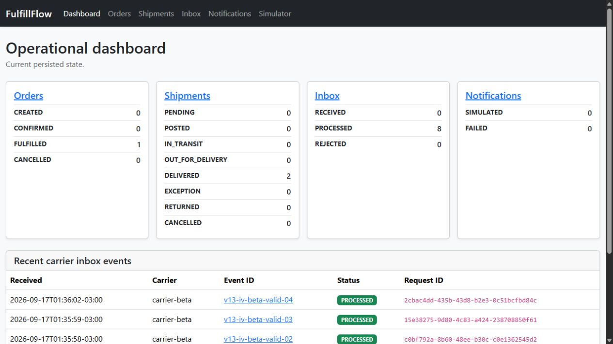
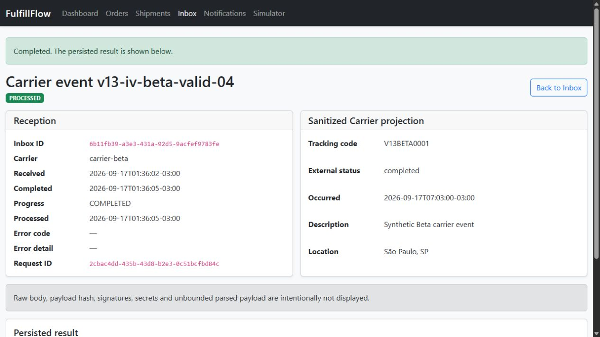
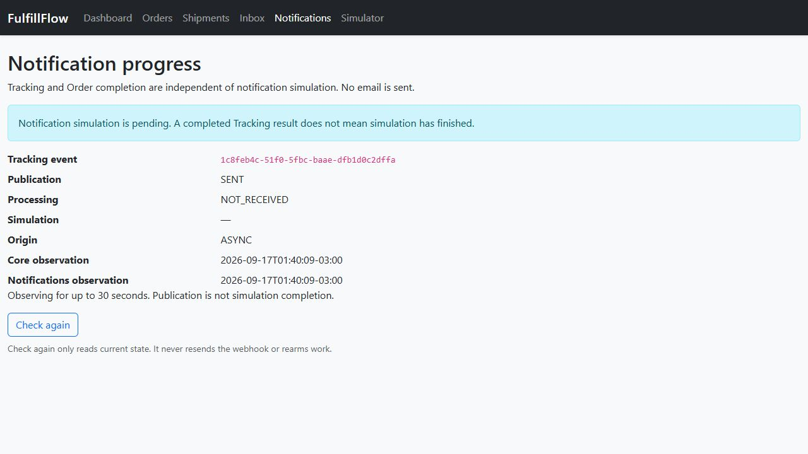
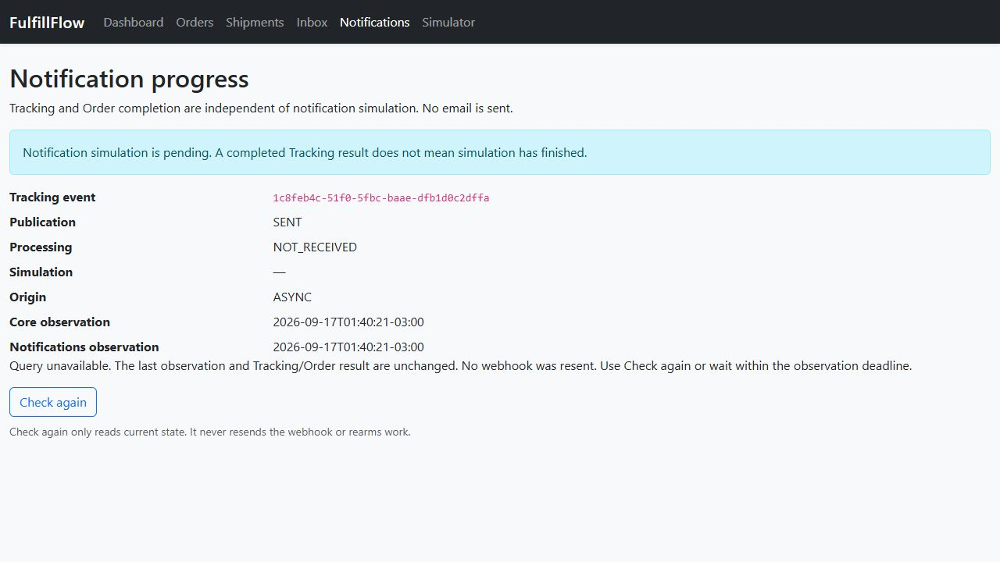
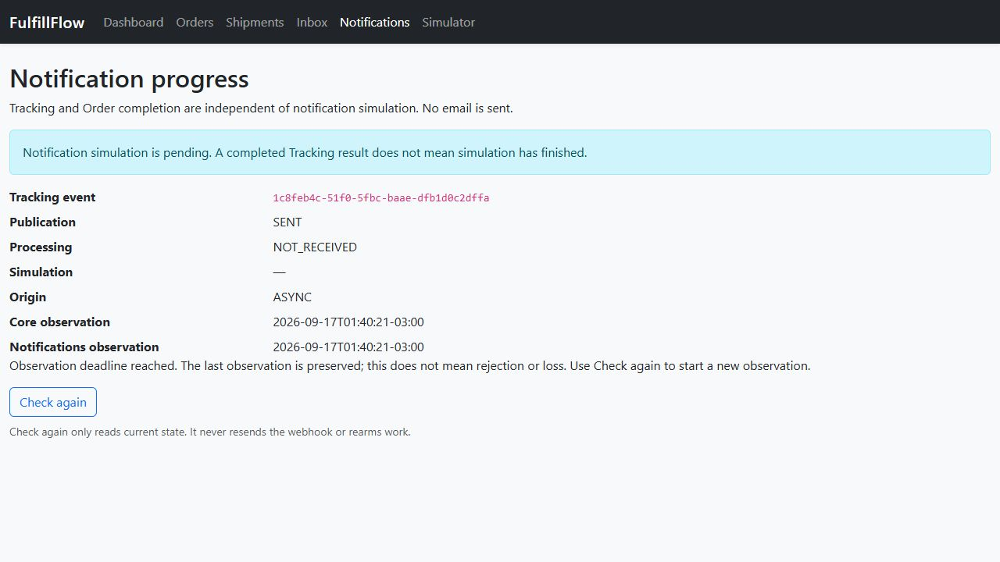
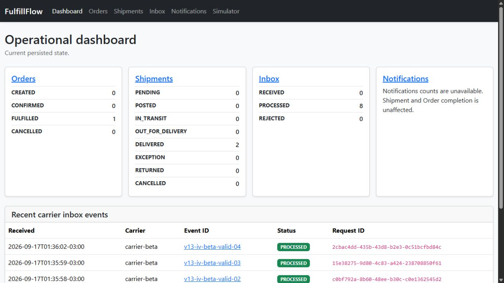
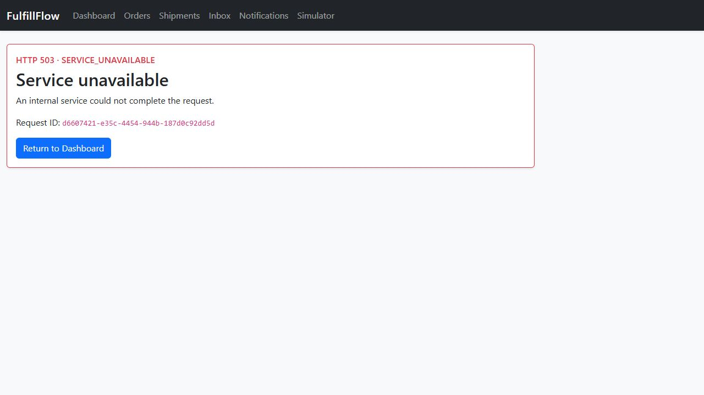
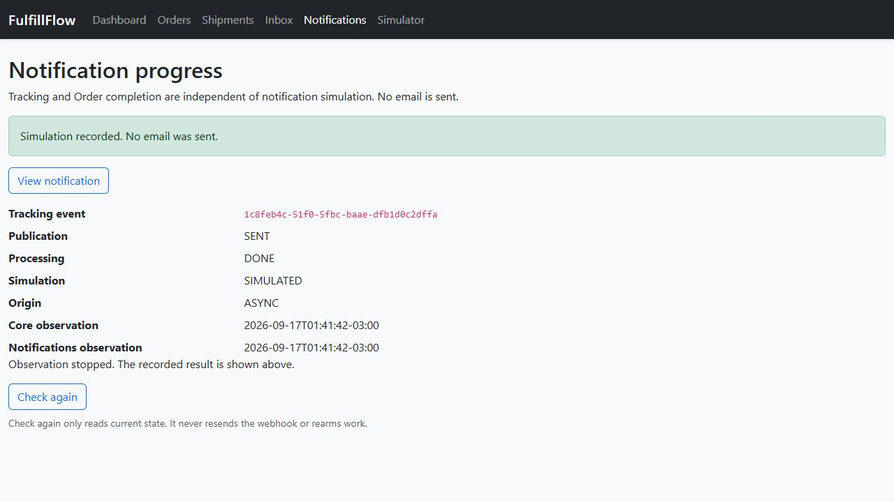
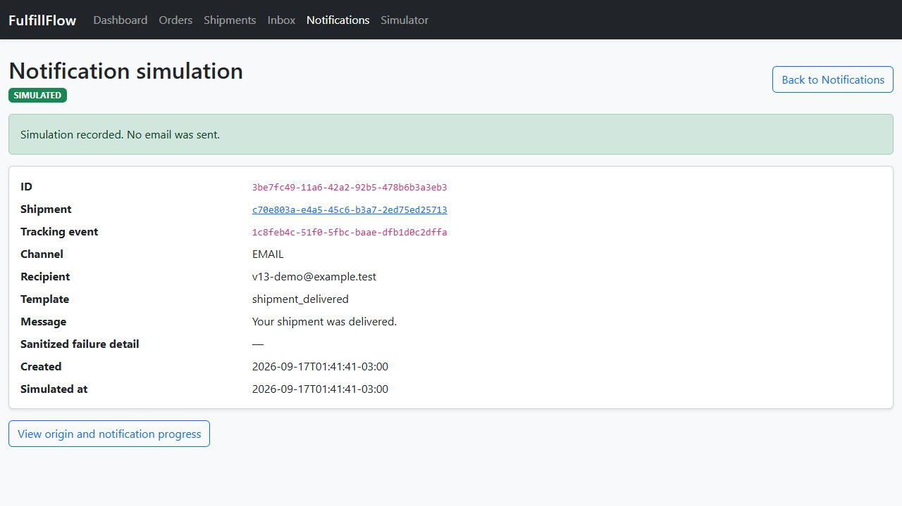
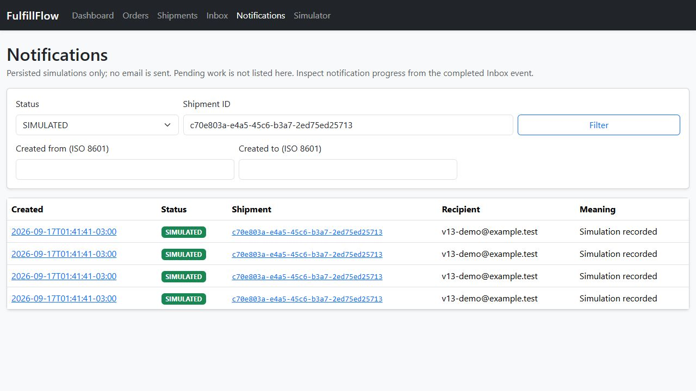

# FulfillFlow v1.3 — Demonstração funcional

Tracking e Notifications assíncronos, dados sintéticos, PostgreSQL/RabbitMQ reais e
entrega somente simulada. O simulador espera Tracking; Notifications é observado
separadamente. Matriz/proveniência no [RELEASE_PLAN](../RELEASE_PLAN.md), recuperação
no [README](../README.md). O [roteiro v1.2 congelado](https://github.com/campos-labs/fulfillflow/blob/9b445f9b5466cd302c89f1deed7a9c051cb397ae/docs/DEMO.md)
e suas capturas abaixo permanecem preservados.

## 1. Recursos novos

PowerShell, Docker Compose, Python 3.13 e `uv sync --frozen`. Execute na raiz deste
worktree, em terminal dedicado, usando defaults sintéticos do Compose; não carregue
`.env` nem URLs de outro ambiente. O projeto cria volumes próprios. O override usa
nomes novos de imagens locais; não sobrescreva uma imagem já usada como evidência.

```powershell
$env:APP_PORT = '18660'
New-Item -ItemType Directory -Force build | Out-Null
$imageSuffix = 'v13-demo-' + [guid]::NewGuid().ToString('N').Substring(0,8)
$services = @{}
foreach ($owner in @('core', 'tracking', 'notifications')) {
    foreach ($name in @($owner, "$owner-worker", "migrate-$owner")) {
        $services[$name] = @{ image = "fulfillflow-${owner}:${imageSuffix}" }
    }
}
@{ services = $services } | ConvertTo-Json -Depth 4 | Set-Content -Encoding utf8 build/compose-iv.yaml
$composeArgs = @('-p', 'fulfillflow-v13-iv-demo', '-f', 'compose.yaml', '-f', 'build/compose-iv.yaml')
docker compose @composeArgs up --build --detach --wait --wait-timeout 120
if ($LASTEXITCODE -ne 0) { throw 'Runtime não ficou saudável' }
$base = 'http://127.0.0.1:18660'
$demo = uv run python scripts/prepare_demo_v13.py --base-url $base | ConvertFrom-Json
if ($LASTEXITCODE -ne 0) { throw 'Preparação falhou' }
```

O preparador é repetível e não apaga dados. Para repetir a jornada completa, use
outro projeto vazio ou remova somente os recursos descartáveis deste roteiro ao final.
Não reinicialize por SQL um Order já concluído.

## 2. Concluir Tracking/Order com worker Notifications parado

```powershell
docker compose @composeArgs stop notifications-worker
$env:CARRIER_ALPHA_WEBHOOK_SECRET = 'f4f67f688c3f40a59079fd6bcc19a7f214c21df9b8a94039a4c0e7cd6cc84385'
$env:CARRIER_BETA_WEBHOOK_SECRET = '3df2b1b16bd84e22987409e9acfc09f6428a8c3573154a478b2084852bc64af2'
uv run python scripts/simulate_carrier_events.py --base-url $base --carrier carrier-alpha --tracking-code V13ALPHA0001 --scenario valid --prefix v13-iv-alpha --start-at 2026-09-17T10:00:00Z
if ($LASTEXITCODE -ne 0) { throw 'Cenário Alpha falhou' }
uv run python scripts/simulate_carrier_events.py --base-url $base --carrier carrier-beta --tracking-code V13BETA0001 --scenario valid --prefix v13-iv-beta --start-at 2026-09-17T10:00:00Z
if ($LASTEXITCODE -ne 0) { throw 'Cenário Beta falhou' }
```

Abra o dashboard: um Order FULFILLED, duas Shipments DELIVERED, oito eventos
PROCESSED e nenhuma simulação ainda. Zero aqui é consulta válida da API ativa,
não ausência de pendência. No Inbox, abra `v13-iv-beta-valid-04` e **Check notification
progress**: Tracking terminou; publicação SENT e processamento NOT_RECEIVED não
significam entrega. A página consulta a cada segundo por até 30 s. Espere o prazo:
a última observação permanece, sem rejeição inventada. **Check again** renova somente
GET. Terminais, BLOCKED e navegação encerram polling; não há reenvio ou rearme.

## 3. Falha de consulta preserva a observação

Com a página de progresso aberta, renove a observação e pare somente a API:

```powershell
docker compose @composeArgs stop notifications
```

O erro aparece sem apagar publication/processing e seus horários anteriores. Em
outra aba, o dashboard mantém Core/Tracking e mostra contagens Notifications
indisponíveis; `/notifications` responde com página HTTP 503, não lista vazia.
Prazo esgotado não transforma o último estado em observação atual confirmada.

```powershell
docker start fulfillflow-v13-iv-demo-notifications-1
```

Espere a API ficar saudável e use **Check again**: consulta retomada sem novo evento.

## 4. Retomar e conferir terminais

```powershell
docker start fulfillflow-v13-iv-demo-notifications-worker-1
```

Durante observação ativa, a página passa a SIMULATED/DONE e interrompe polling;
se o prazo acabou, use **Check again**. Não envie outro webhook para recuperar.
Abra Notifications: oito registros. Filtre SIMULATED e Shipment (quatro por
transportadora), abra o detalhe e confira IDs/datas. Nenhum email foi enviado.

FAILED é terminal de simulação, diferente de pendência, BLOCKED ou indisponibilidade.
O renderer normal é determinístico e bem-sucedido: FAILED/BLOCKED têm testes com
falha/estado injetado, identificados na matriz; não foram fabricados no runtime
para capturas. LEGACY usa o ensaio offline do README, preserva conteúdo original e
explicita que publication/processing não foram registrados.

## 5. Duplicata sem efeito adicional

Recrie os bytes determinísticos do último evento, com timestamp atual na assinatura
para respeitar a janela HMAC. Este comando usa o consumidor externo existente,
sem importar regras da aplicação ou imprimir segredo/assinatura:

```powershell
uv run python -c "import os,json; from datetime import datetime; from urllib.request import urlopen; from scripts.simulate_carrier_events import SimulatorConfig,build_scenario,send_request; base='http://127.0.0.1:18660'; before=json.load(urlopen(base+'/api/v1/notifications',timeout=10)); config=SimulatorConfig(base,'carrier-beta','V13BETA0001','valid',None,'v13-iv-beta',datetime.fromisoformat('2026-09-17T10:00:00+00:00'),10,os.environ['CARRIER_BETA_WEBHOOK_SECRET']); result=send_request(build_scenario(config).steps[-1].artifact,timeout=10); assert result.status==200 and result.payload['result']=='DUPLICATE'; after=json.load(urlopen(base+'/api/v1/notifications',timeout=10)); assert before==after and after['total']==8; print('DUPLICATE: oito terminais preservados integralmente')"
if ($LASTEXITCODE -ne 0) { throw 'Duplicata divergiu do contrato' }
```

## Capturas reais v1.3

Navegador real em 2026-09-17, projeto `fulfillflow-v13-iv-demo`; controle somente de
containers próprios. Sem edição visual, atrasos de runtime ou estados SQL fabricados.
Identidades/proveniência no RELEASE_PLAN.












A [evidência de duplicata](assets/demo/v1.3/duplicate-result.json) registra igualdade
integral dos oito terminais antes/depois, contagem e hash da observação.

## Capturas da demonstração

### Estados assíncronos da v1.2

Capturas reais de 2026-09-16, com dados sintéticos novos no projeto isolado
`fulfillflow-f05e-iv-demo`. Runtime do SHA
`eb9b51727023cf83cf8574f5ff0b502af2c620a0`, imagem local
`fulfillflow:iv-eb9b51727023`; proveniência completa no RELEASE_PLAN.
Somente os dois estados abaixo foram recapturados no fechamento. Formulários,
polling/falhas/prazo, timeline, Notifications, Order e duplicata reutilizam a
conferência visual do incremento IV registrada na matriz de aceite.


Workers pausados apenas no ambiente próprio: aceitação durável não representa
conclusão. A tela oferece observação limitada e nova consulta explícita.


Após retomar os workers, o mesmo inbox mostra `COMPLETED`, timestamps e resultado
`APPLIED`, com link para a timeline. É a conclusão do primeiro evento (`POSTED`),
não uma afirmação de que toda a Shipment já foi entregue.

### Capturas históricas da v1.0.0

As imagens abaixo são capturas históricas da aplicação real v1.0.0, preservadas
como ilustrações da interface. Não são capturas da v1.1 ou v1.2. Todos os dados são sintéticos.
A conferência funcional v1.1 possui registro próprio em
[benchmarks/V11_REVIEW.md](../benchmarks/V11_REVIEW.md), sem substituir essas imagens.

Não use geração de imagens e não exponha secrets, assinaturas, DSN ou variáveis
de ambiente.


Dashboard com os estados operacionais e os eventos recentes.


Order em `FULFILLED`, com sua Shipment vinculada.


Linha do tempo dos eventos da Shipment e seus resultados de aplicação.


Instruções para executar o simulador externo; o painel não envia eventos.

## Encerrar somente este ambiente

```powershell
docker compose @composeArgs down --volumes
```

Remove somente volumes descartáveis deste projeto; imagens e capturas permanecem.
Não execute contra projetos/evidências históricos.

## Limites

Aceite funcional sem campanha de carga ou estabilidade prolongada demonstrada.
Persistência idempotente não prova exactly-once externo. Falhas comuns de processo,
PostgreSQL, broker e recursos continuam possíveis. Corte offline; provedores reais,
cloud, comparação extensa e publicação estão fora deste aceite.
