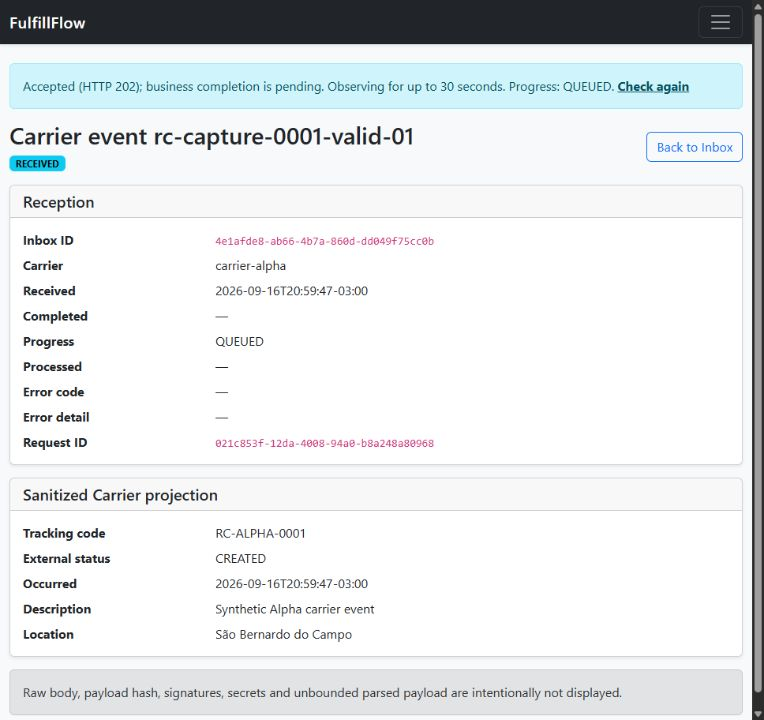
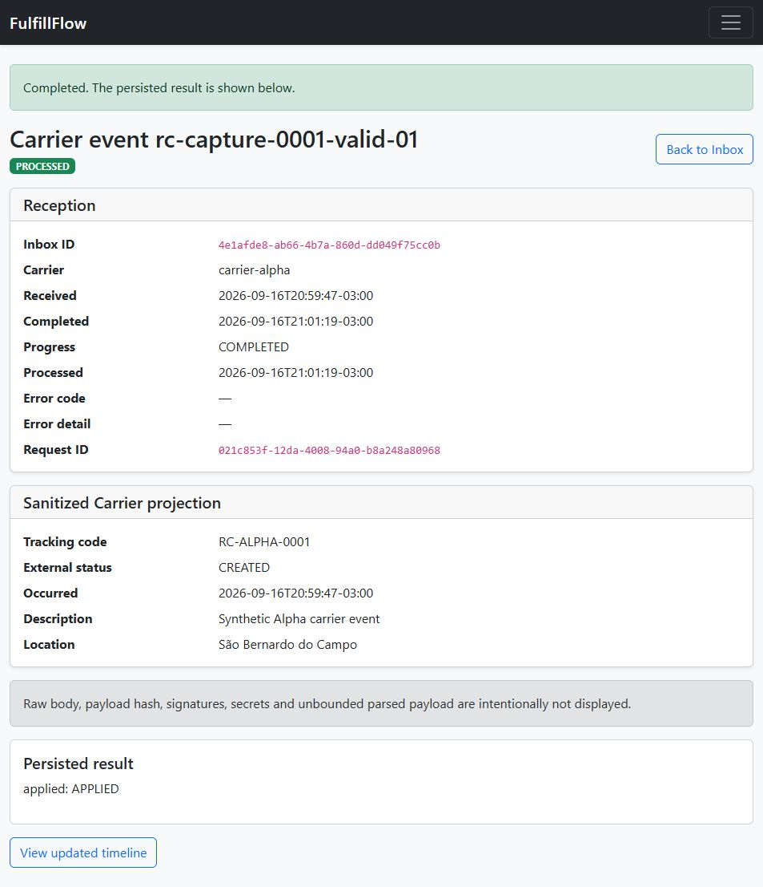
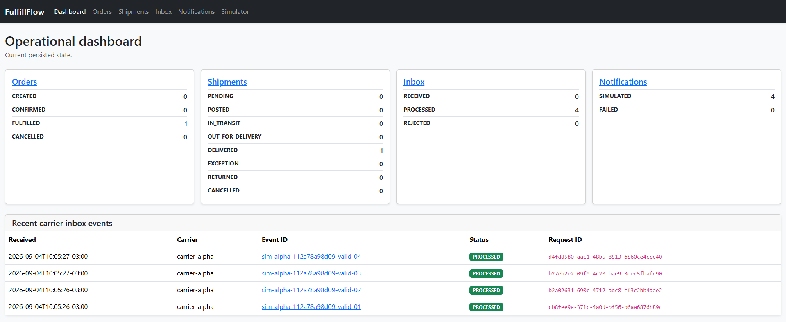
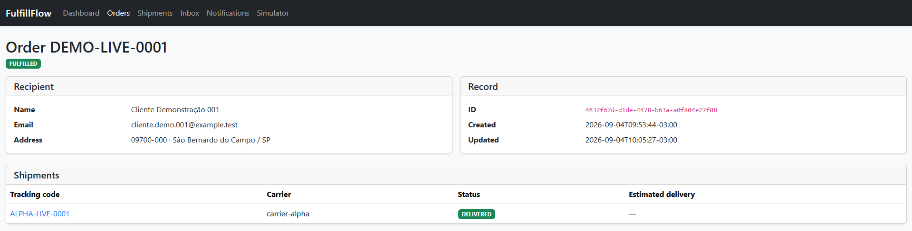
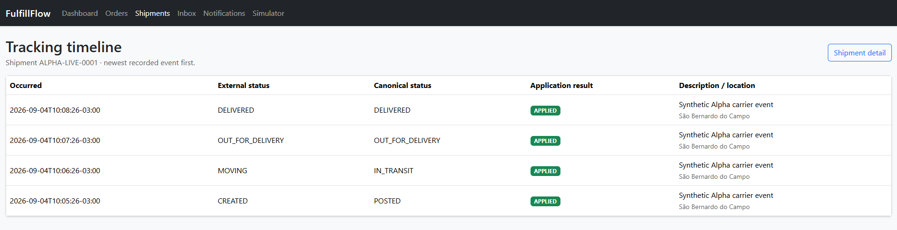
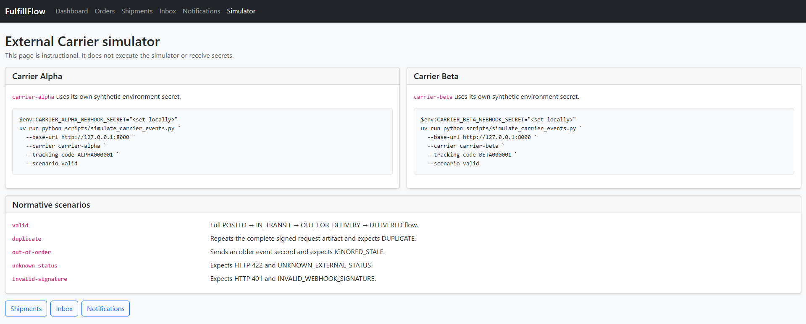

# Demonstração funcional do FulfillFlow v1.2 — aceite I–IV

Este roteiro apresenta a jornada principal do FulfillFlow em um ambiente local e
controlado: criação de um `Order`, criação de uma `Shipment`, recebimento de
eventos de uma transportadora simulada e consulta dos efeitos pela interface.

A interface é um painel operacional interno. A aplicação não possui cadastro ou
login de usuários e não deve ser exposta diretamente à internet.

## O que será demonstrado

- criação e confirmação de um `Order`;
- criação de uma `Shipment` vinculada ao Carrier Alpha;
- envio externo de webhooks autenticados com HMAC-SHA256;
- evolução da `Shipment` até `DELIVERED`;
- timeline de `TrackingEvent`, inbox auditável e `Notification` simulada;
- conclusão automática do `Order` quando todas as suas Shipments não canceladas
  estiverem entregues;
- idempotência com a repetição do mesmo evento.

Todos os dados e secrets abaixo são exclusivamente sintéticos. Nenhuma
transportadora ou conta de e-mail real é utilizada.

## Pré-requisitos

- checkout validado da branch `feature/v1.2-tracking-async`;
- Docker Engine com Docker Compose;
- Python 3.13 e `uv` para executar o simulador externo;
- PowerShell;
- porta `127.0.0.1:18560` disponível.

Execute todos os comandos a partir da raiz do repositório.

## 1. Configurar o ambiente local

Na sessão do PowerShell usada para iniciar o Compose e o simulador, defina:

```powershell
$env:APP_ENV = "local"
$env:APP_PORT = "18560"
$env:POSTGRES_PASSWORD = "fulfillflow-demo-admin-password-2026"
$env:CORE_DB_PASSWORD = "fulfillflow-demo-core-password-2026"
$env:TRACKING_DB_PASSWORD = "fulfillflow-demo-tracking-password-2026"
$env:CORE_DATABASE_URL = "postgresql+psycopg://fulfillflow_core:fulfillflow-demo-core-password-2026@db:5432/fulfillflow_core"
$env:TRACKING_DATABASE_URL = "postgresql+psycopg://fulfillflow_tracking:fulfillflow-demo-tracking-password-2026@db:5432/fulfillflow_tracking"
$env:INTERNAL_API_SECRET = "fulfillflow-demo-internal-2026-local-only-72be"
$env:SESSION_SECRET = "fulfillflow-demo-session-2026-local-only-7f91"
$env:CARRIER_ALPHA_WEBHOOK_SECRET = "fulfillflow-demo-alpha-2026-local-only-a84e"
$env:CARRIER_BETA_WEBHOOK_SECRET = "fulfillflow-demo-beta-2026-local-only-b73c"
```

Cada senha de role deve coincidir com seu DSN. Use volumes novos e exclusivos da demonstração; não
reutilize o banco da v1.0. Os secrets Alpha e Beta precisam ser distintos e ficam
no Tracking. Core recebe somente o secret de sessão e o token interno comum.
As telas e os webhooks continuam acessíveis pela porta pública do Core.

## 2. Iniciar a aplicação

Prepare o ambiente Python do simulador e inicie o stack:

```powershell
uv sync --frozen
$demoProject = "fulfillflow-v12-demo"
if (docker ps -a --filter "label=com.docker.compose.project=$demoProject" --format '{{.ID}}') {
    throw "Projeto já existente: escolha outro nome; não remova dados anteriores."
}
if (docker volume ls --filter "label=com.docker.compose.project=$demoProject" --format '{{.Name}}') {
    throw "Volumes já existentes: escolha outro nome de projeto."
}
$demoSha = git rev-parse HEAD
$demoImage = "fulfillflow:demo-$demoSha"
$demoOverride = Join-Path $env:TEMP "$demoProject.override.yaml"
$demoServices = 'core','tracking','core-worker','tracking-worker','migrate-core','migrate-tracking'
$demoLines = @('services:')
foreach ($service in $demoServices) {
    $demoLines += "  ${service}:"
    $demoLines += "    image: $demoImage"
}
$demoLines | Set-Content -LiteralPath $demoOverride -Encoding utf8
$env:RABBITMQ_HOSTNAME = 'demo-broker'
docker build --target runtime -t $demoImage .
docker compose -p $demoProject -f compose.yaml -f $demoOverride up -d --no-build --wait --wait-timeout 180
```

Confirme que a aplicação está pronta:

```powershell
Invoke-WebRequest http://127.0.0.1:18560/health/live
Invoke-WebRequest http://127.0.0.1:18560/health/ready
```

As duas respostas devem retornar HTTP 200 e `{"status":"ok"}`.

| Tela | URL |
|---|---|
| Dashboard | `http://127.0.0.1:18560/` |
| Orders | `http://127.0.0.1:18560/orders` |
| Shipments | `http://127.0.0.1:18560/shipments` |
| Carrier event inbox | `http://127.0.0.1:18560/carrier-events` |
| Notifications | `http://127.0.0.1:18560/notifications` |
| Instruções do simulador | `http://127.0.0.1:18560/simulator` |

O painel `/simulator` apresenta os comandos disponíveis, mas não envia eventos.
Os webhooks são enviados pelo processo externo
`scripts/simulate_carrier_events.py`.

## 3. Criar e confirmar um Order

1. Abra **Orders** e selecione **Create Order**.
2. Preencha o formulário com estes dados sintéticos:

   - `External reference`: `DEMO-LIVE-0001`;
   - `Recipient name`: `Cliente Demonstração 001`;
   - `Synthetic email`: `cliente.demo.001@example.test`;
   - `Postal code`: `09700-000`;
   - `City`: `São Bernardo do Campo`;
   - `State`: `SP`.

3. Selecione **Create Order** e confirme o estado inicial `CREATED`.
4. Selecione **Confirm** e confirme a mudança para `CONFIRMED`.

Uma `Shipment` só pode ser criada para um `Order` confirmado.

## 4. Criar a Shipment

1. No detalhe do `Order`, selecione **Create Shipment**.
2. Confirme que o `Order ID` está preenchido.
3. Selecione `Carrier Alpha`.
4. Informe `ALPHA-LIVE-0001` em `Tracking code`.
5. Deixe `Estimated delivery date` vazio ou use uma data sintética.
6. Selecione **Create Shipment**.
7. Confirme no detalhe:

   - Carrier `carrier-alpha`;
   - tracking code `ALPHA-LIVE-0001`;
   - estado inicial `PENDING`.

Anote o UUID da `Shipment`, pois ele poderá ser usado para filtrar as
Notifications. A timeline ainda deverá informar que não existem eventos.

## 5. Enviar os eventos do Carrier Alpha

Na mesma sessão do PowerShell que contém o secret Alpha, execute:

```powershell
uv run python scripts/simulate_carrier_events.py `
  --base-url http://127.0.0.1:18560 `
  --carrier carrier-alpha `
  --tracking-code ALPHA-LIVE-0001 `
  --scenario valid
```

O simulador envia quatro eventos:

```text
POSTED → IN_TRANSIT → OUT_FOR_DELIVERY → DELIVERED
```

Cada evento novo deve apresentar uma linha `phase=accepted`, HTTP 202 e
`inbox_event_id`, seguida de consulta com `phase=completed`, `"result":"APPLIED"`
e `"success":true`. A última deve apresentar
`"current_status":"DELIVERED"`. Exit code zero indica que todas as respostas
corresponderam ao contrato esperado.

## 5.1 Observar pendência e prazo sem atrasar o runtime

Esta é uma variante da seção 5: escolha-a antes de enviar os eventos, com a
Shipment ainda em `PENDING`. Não execute primeiro o cenário completo e depois
repita-o sobre a Shipment já entregue. Somente neste projeto isolado, pause os workers:

```powershell
docker compose -p $demoProject -f compose.yaml -f $demoOverride stop core-worker tracking-worker
```

Execute o comando da seção 5 em outro terminal com os mesmos secrets, acrescentando
`--completion-timeout-seconds 90`. Abra `/carrier-events/{inbox_event_id}` usando o
ID emitido. Confirme aceitação, `RECEIVED/QUEUED` e consultas HTMX a cada segundo.
Após 30 segundos, a UI encerra sua observação e mostra prazo esgotado, sem rejeição.
O cliente de linha de comando tem prazo independente. Se ele também expirar,
`RESULT_NOT_OBSERVED`/exit 1 indica resultado não observado, não perda do evento.
Para concluir os quatro passos na mesma execução, retome os workers enquanto o
simulador ainda aguarda. Se ele já encerrou, o evento aceito continua consultável,
mas os passos seguintes não foram enviados; uma nova demonstração completa deve
usar outra Shipment `PENDING` e referências novas, sem apagar a anterior.

Retome somente os workers desse projeto:

```powershell
docker compose -p $demoProject -f compose.yaml -f $demoOverride start core-worker tracking-worker
```

Use **Check again** para uma nova observação. Confirme conclusão e o link para a
timeline. A consulta não reenvia o webhook. Falhas temporárias de consulta mostram
aviso e são tentadas novamente dentro do prazo; `BLOCKED_LOCAL` exige a operação
auditada descrita no README, sem prometer recuperação automática.

## 6. Conferir os efeitos na interface

1. Atualize o detalhe da `Shipment` e confirme o estado `DELIVERED`, além de
   `Shipped at`, `Delivered at` e `Status occurred at` preenchidos.
2. Abra **Tracking timeline** e confirme os quatro estados canônicos. Todos
   devem apresentar `Application result` igual a `APPLIED`.
3. Abra **Inbox**, filtre por um `event_id` exibido pelo simulador e confirme o
   estado `PROCESSED`. O detalhe apresenta a projeção sanitizada, sem assinatura,
   secret ou `raw_body`.
4. Abra **Notifications**, filtre pelo UUID da `Shipment` e confirme quatro
   registros `SIMULATED`. Nenhum e-mail é enviado.
5. Volte ao `Order`. Como ele possui somente essa Shipment não cancelada, seu
   estado deverá ser `FULFILLED`.
6. Volte ao Dashboard e confira as contagens e os eventos recentes.

## 7. Demonstrar idempotência

Crie outro `Order` confirmado e outra Shipment Alpha em `PENDING`, usando o
tracking code `ALPHA-DUP-0001`. Em seguida, execute:

```powershell
uv run python scripts/simulate_carrier_events.py `
  --base-url http://127.0.0.1:18560 `
  --carrier carrier-alpha `
  --tracking-code ALPHA-DUP-0001 `
  --scenario duplicate
```

A primeira tentativa deve ser aceita com 202 e posteriormente concluir `APPLIED`;
a repetição do mesmo evento deve
retornar `DUPLICATE` com `original_result` igual a `APPLIED`. A repetição não
cria outro inbox, `TrackingEvent` ou `Notification`.

O simulador também oferece `out-of-order`, `unknown-status` e
`invalid-signature`. No último caso, HTTP 401 com
`INVALID_WEBHOOK_SIGNATURE` é o resultado esperado e nenhum inbox é criado.

## Como o fluxo funciona

O simulador serializa o payload uma vez, assina os mesmos bytes enviados e chama
`POST /api/v1/carriers/{carrier_code}/events`. Tracking autentica e confirma inbox/comando/outbox em uma transação antes do 202.
Workers transportam comando e resultado via RabbitMQ. Core confirma recibo, efeitos
e outbox de resultado atomicamente; Tracking finaliza em outra transação local.
ACK técnico não é conclusão de negócio.
Detalhes de transações, locks e idempotência permanecem documentados em
`DESIGN.md`.

## Capturas da demonstração

### Estados assíncronos da v1.2

Capturas reais de 2026-09-16, com dados sintéticos novos no projeto isolado
`fulfillflow-f05e-iv-demo`. Runtime do SHA
`eb9b51727023cf83cf8574f5ff0b502af2c620a0`, imagem local
`fulfillflow:iv-eb9b51727023`; proveniência completa no RELEASE_PLAN.
Somente os dois estados abaixo foram recapturados no fechamento. Formulários,
polling/falhas/prazo, timeline, Notifications, Order e duplicata reutilizam a
conferência visual do incremento IV registrada na matriz de aceite.



Workers pausados apenas no ambiente próprio: aceitação durável não representa
conclusão. A tela oferece observação limitada e nova consulta explícita.



Após retomar os workers, o mesmo inbox mostra `COMPLETED`, timestamps e resultado
`APPLIED`, com link para a timeline. É a conclusão do primeiro evento (`POSTED`),
não uma afirmação de que toda a Shipment já foi entregue.

### Capturas históricas da v1.0.0

As imagens abaixo são capturas históricas da aplicação real v1.0.0, preservadas
como ilustrações da interface. Não são capturas da v1.1 ou v1.2. Todos os dados são sintéticos.
A conferência funcional v1.1 possui registro próprio em
[benchmarks/V11_REVIEW.md](../benchmarks/V11_REVIEW.md), sem substituir essas imagens.

Não use geração de imagens e não exponha secrets, assinaturas, DSN ou variáveis
de ambiente.



Dashboard com os estados operacionais e os eventos recentes.



Order em `FULFILLED`, com sua Shipment vinculada.



Linha do tempo dos eventos da Shipment e seus resultados de aplicação.



Instruções para executar o simulador externo; o painel não envia eventos.

## Encerrar o ambiente

```powershell
docker compose -p $demoProject -f compose.yaml -f $demoOverride stop
```

O encerramento preserva volumes, imagens e evidência sintética para inspeção.
Não remova recursos de outros projetos nem substitua imagens históricas.

## Limitações

- não há autenticação de usuários, Carrier real ou envio real de e-mail;
- o bind padrão é local, em `127.0.0.1`;
- `/simulator` é somente instrucional;
- aceitação e conclusão são distintas; falhas de consulta não desfazem admissão;
- logs/diagnóstico locais não representam observabilidade ampla nem estabilidade prolongada;
- o roteiro não substitui as suítes automatizadas;
- o roteiro não executa Locust nem produz baseline ou resultado oficial de
   benchmark.
